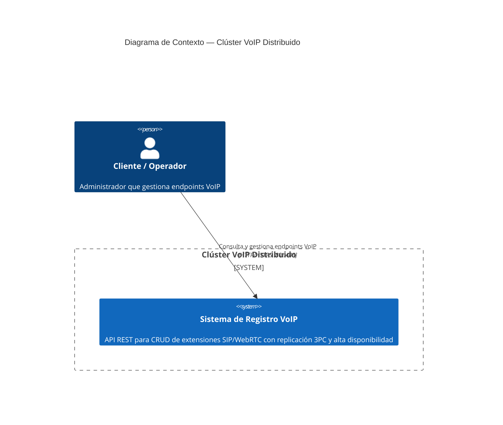
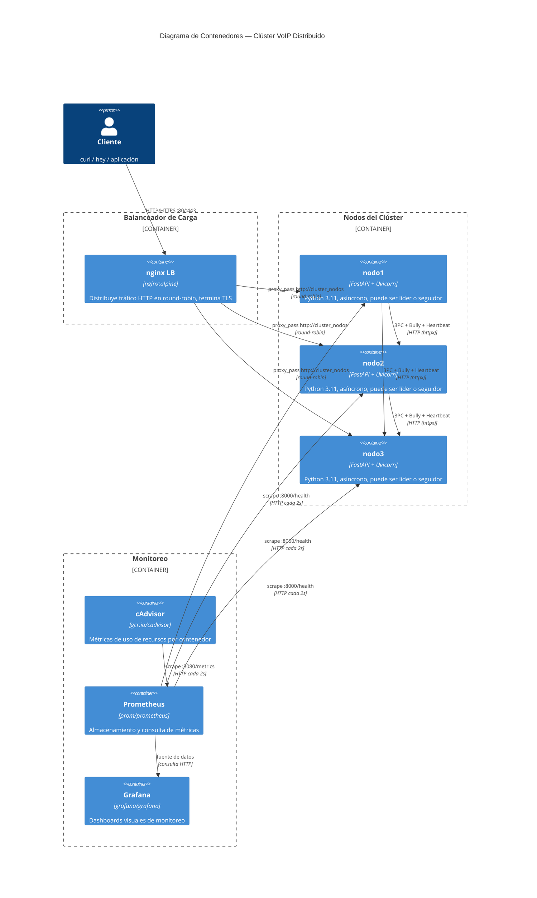
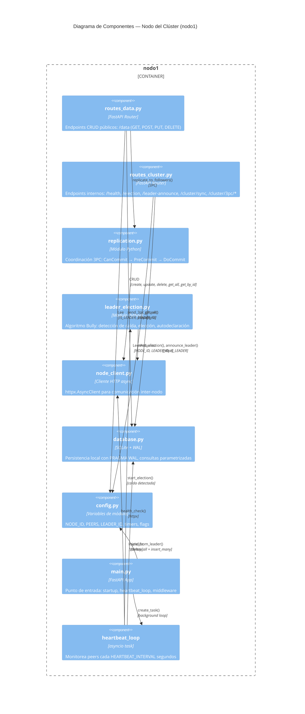
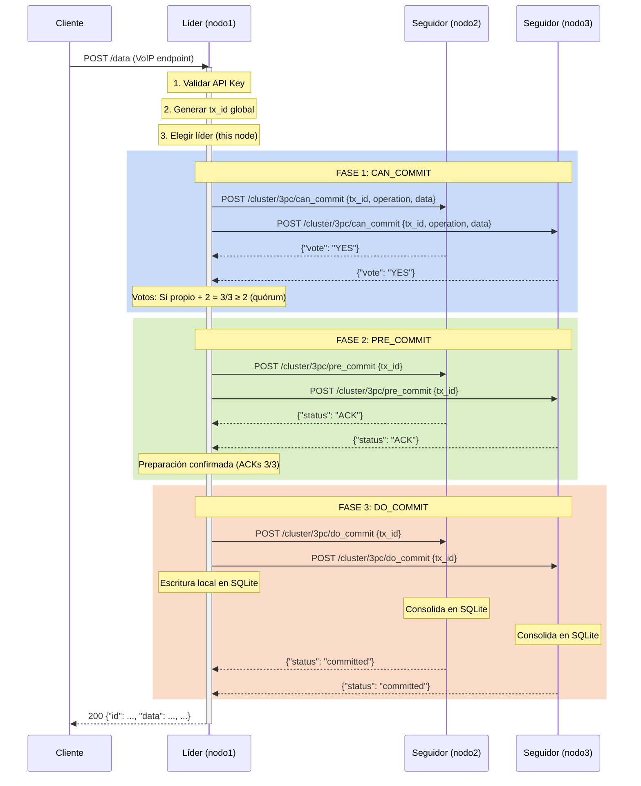

# Informe Completo del Proyecto

## Clúster Distribuido VoIP — Servicios Web con Alta Disponibilidad

**Autor:** Marcelo
**Fecha:** Julio 2026
**Repositorio:** github.com/Marcelo160102/Cluster-distribuido

---

> Este documento consolida toda la documentación del proyecto en un solo archivo:
> arquitectura, instalación, seguridad, monitoreo, pruebas, rendimiento y video.


---

<!-- source: docs/enunciado_del_proyecto.md -->
## **Enunciado del proyecto** 

## **Proyecto: Levantamiento de un clúster de cómputo** 

Desarrolle, documente y ponga en funcionamiento un clúster (HPC, Big Data o de servicios web, según la finalidad académica que usted elija) siguiendo las fases descritas a continuación. La evidencia de cada fase debe entregarse en un repositorio Git (público o privado) y resumirse en un informe técnico. 

## **Fases y entregables** 

|**Fase**|**Entregable principal**|**Detalles que deben incluirse**|
|---|---|---|
|1.<br>Planificación<br>y<br>diseño arquitectónico|<br> <br>Documento<br>de<br>arquitectura + diagrama<br>normalizado|<br> <br>• Justificación del tipo de clúster, topología de<br>red y dimensionamiento.• Diagrama actualizado<br>con notación estándar (p. ej., C4 o UML).|
|2. Configuración e<br>instalación|<br>Scripts/Ansible<br>playbooks + checklist de<br>instalación|<br>• Elección y justificación de SO, middleware y<br>servicios.•<br>Automatización<br>reproducible<br>(infraestructura como código).|
|3. Seguridad y alta<br>disponibilidad|<br>Archivo de políticas +<br>evidencia de pruebas|<br>• Autenticación, cifrado, firewall y monitoreo.•<br>Configuración de balanceo o fail-over con<br>registro de pruebas.|
|4.<br>Pruebas<br>de<br>rendimiento<br>y<br>validación|<br> <br>Reporte de métricas|• Latencia, throughput y escalabilidad medidos<br>con herramientas adecuadas.• Análisis crítico de<br>los resultados.|
|5.<br>Documentación<br>técnica|<br>Manual PDF (estándar<br>APA/IEEE)|<br>• Instalación, operación y mantenimiento paso a<br>paso.• Glosario y apéndice de comandos.|


## **Formato y evaluación** 

- **Puntuación total: 10 puntos** , distribuida según la **rúbrica analítica adjunta** (Planificación 2 pts, Instalación 3 pts, Seguridad/HA 2 pts, Pruebas 1 pt, Documentación 1 pt, Presentación 1 pt solo explicación breve cosas puntuales). 

- **Fecha de entrega** : 08 /07 / 2025, 09:00. 

- **Modalidad de entrega** : PDF del informe y de manera presencial en sus ordenadores o como quedara el caso de ese día 

## **Recomendaciones** 

1. **Versione** todo su trabajo; cada commit debe reflejar un paso lógico. 

2. Pruebe sus scripts en al menos dos nodos para garantizar reproducibilidad. 

3. Incorpore capturas de pantalla o registros de comandos clave como anexo. 


---

<!-- source: docs/Proyecto_Sistemas_Distribuidos_2026.md -->
## **Proyecto: Implementación de un Clúster Distribuido con Replicación de Datos** 

## **1. Introducción** 

Los sistemas distribuidos constituyen una de las áreas más importantes de la informática moderna, ya que permiten que múltiples computadoras o nodos trabajen de manera coordinada para ofrecer servicios confiables, escalables y tolerantes a fallos. Actualmente, gran parte de las aplicaciones utilizadas en entornos empresariales, plataformas web, servicios en la nube y centros de datos se basan en arquitecturas distribuidas que permiten compartir recursos, procesar grandes volúmenes de información y garantizar la continuidad del servicio incluso ante fallos de hardware o software. 

Uno de los principales desafíos en este tipo de sistemas es mantener la consistencia y disponibilidad de la información cuando esta se encuentra distribuida en varios nodos. Para solucionar este problema se emplean técnicas como la replicación de datos, que consiste en almacenar copias de la información en diferentes servidores, permitiendo que el sistema continúe funcionando aun cuando alguno de los nodos deje de estar disponible. Asimismo, es necesario contar con mecanismos de consenso que permitan coordinar las decisiones entre los nodos participantes, garantizando que todos mantengan una visión coherente del estado del sistema. 

En este proyecto, los estudiantes desarrollarán un pequeño clúster distribuido compuesto por tres nodos interconectados capaces de intercambiar información y mantener réplicas consistentes de los datos. Además, se implementará un mecanismo básico de consenso o elección de líder que permita coordinar las operaciones del sistema y gestionar situaciones de fallo. A través de este desarrollo, los estudiantes podrán comprender de forma práctica conceptos fundamentales de los sistemas distribuidos, tales como replicación, consistencia, tolerancia a fallos, coordinación entre nodos y alta disponibilidad, aplicando los conocimientos adquiridos durante el curso en un escenario similar a los utilizados en entornos reales. 

## **2. Objetivos** 

Objetivo General: 

- Desarrollar un prototipo de sistema distribuido que implemente replicación de datos y un mecanismo básico de consenso entre nodos. 

Objetivos Específicos: 

- Diseñar una arquitectura distribuida basada en múltiples nodos. 

- Implementar la replicación de información entre nodos. 

- Implementar un mecanismo básico de consenso o elección de líder. 

- Evaluar el comportamiento del sistema ante la caída de un nodo. 

## **3. Alcance** 

El sistema deberá estar conformado por tres nodos conectados mediante red local o contenedores Docker. Cada nodo deberá almacenar información, replicar cambios, participar en un proceso de consenso y continuar operando cuando uno de los nodos deje de estar disponible. 

## **4. Desarrollo** 

El proyecto deberá implementar un clúster distribuido compuesto por tres nodos capaces de intercambiar información y coordinar sus operaciones. 

## **4.1 Arquitectura del Sistema** 

Los estudiantes deberán diseñar e implementar una arquitectura distribuida conformada por tres nodos conectados mediante red local o contenedores Docker. 

Se deberá presentar: 

- Diagrama de arquitectura del clúster. 

- Descripción de los componentes de cada nodo. 

- Descripción de los mensajes intercambiados entre nodos. 

- Identificación del nodo líder y nodos seguidores (si aplica). 

**Herramientas sugeridas:** Docker, Docker Compose, Python, Java, Node.js o Go. 

## **4.2 Replicación de Datos** 

Se deberá implementar un mecanismo de replicación que permita que la información almacenada en un nodo sea copiada automáticamente a los demás nodos del clúster. 

Se deberá demostrar: 

- Creación de registros. 

- Actualización de registros. 

- Sincronización correcta entre los nodos. 

- Consistencia de la información replicada. 

#### **Opciones recomendadas:** 

- Replicación Maestro-Esclavo (Primary-Replica). 

- Replicación Activa entre nodos. 

- Base de datos distribuida simple utilizando archivos JSON o SQLite. 

## **4.3 Mecanismo de Consenso o Elección de Líder** 

El sistema deberá implementar un mecanismo básico que permita seleccionar automáticamente un nodo líder responsable de coordinar determinadas operaciones. 

Se deberá demostrar: 

- Selección inicial del líder. 

- Detección de la caída del líder. 

- Elección automática de un nuevo líder. 

- Continuidad del servicio después del fallo. 

## **Algoritmos recomendados:** 

- Bully Algorithm. 

- Ring Election Algorithm. 

## **4.4 Pruebas de Funcionamiento** 

Los estudiantes deberán realizar pruebas que evidencien el correcto funcionamiento del sistema distribuido. 

Como mínimo deberán demostrar: 

1. Replicación exitosa de información entre nodos. 

2. Sincronización correcta de los datos replicados. 

3. Desconexión o apagado de un nodo. 

4. Elección automática de un nuevo líder (si aplica). 

5. Continuidad del servicio con los nodos restantes. 

Se deberán incluir capturas de pantalla o evidencias de las pruebas realizadas. 

## **5. Entregables** 

|**N.°**|**Entregable**|**Descripción**|
|---|---|---|
|1|Informe técnico|Documento final del proyecto con introducción, objetivos,<br>arquitectura, implementación, pruebas y conclusiones (máximo 15<br>páginas).|
|2|Código fuente<br>documentado|Código desarrollado para la implementación del clúster,<br>incluyendo comentarios y guía básica de ejecución.|
|3|Diagrama de<br>arquitectura|Representación gráfica de los nodos, las comunicaciones y el<br>mecanismo de replicación implementado.|
|4|Video demostrativo|Video de máximo 10 minutos mostrando el funcionamiento del<br>sistema, la replicación de datos y la tolerancia a fallos.|
|5|Presentación final|Exposición del proyecto donde se describa la solución desarrollada,<br>resultados obtenidos y lecciones aprendidas.|


## **6. Criterios de Evaluación** 

Diseño de arquitectura: 20% Replicación: 30% Consenso/Líder: 25% Pruebas y demostración: 15% Documentación y presentación: 10% 


---

<!-- source: docs/arquitectura.md -->
# Documento de Arquitectura — Clúster Distribuido de Servicios Web

> **Fase 1 — Planificación y Diseño Arquitectónico**
> Proyecto: Sistemas Distribuidos 2026

---

## 1. Justificación del Tipo de Clúster

Se elige un **clúster de servicios web** (no HPC ni Big Data) por las siguientes razones:

| Criterio | HPC | Big Data | Servicios Web (elegido) |
|---|---|---|---|
| **Carga de trabajo** | Cálculo intensivo (MPI, GPU) | Procesamiento batch (MapReduce) | **Operaciones CRUD + réplicas sincrónicas** |
| **Volumen de datos** | TB–PB por trabajo | TB–PB en reposo | **KB–MB por registro VoIP** |
| **Latencia requerida** | Horas–días | Minutos–horas | **< 100 ms por operación** |
| **Concurrencia** | Baja (jobs secuenciales) | Media (lotes) | **Alta (múltiples clientes simultáneos)** |
| **Middleware típico** | Slurm, OpenMPI | Hadoop, Spark | **FastAPI, Nginx, SQLite WAL** |
| **Protocolo de consenso** | No aplica | No aplica | **3PC (Three-Phase Commit)** |
| **Algoritmo de elección** | No aplica | No aplica | **Bully Algorithm** |

**Conclusión:** El clúster sirve peticiones REST concurrentes (alta disponibilidad, baja latencia, consistencia de datos), lo que lo alinea con la categoría de servicios web. El dominio concreto es el **Registro Distribuido de Endpoints VoIP (SIP, WebRTC)**, donde cada nodo mantiene una copia actualizada del inventario de extensiones activas.

---

## 2. Topología de Red

```
                             ┌──────────────┐
                             │   Cliente    │
                             │  (curl/hey)  │
                             └──────┬───────┘
                                    │ HTTP :80
                                    ▼
                     ┌──────────────────────────┐
                     │    nginx Load Balancer   │
                     │   (balanceo round-robin) │
                     │   Puerto 80 → 443 (TLS)  │
                     └──────┬──────────┬────────┘
                            │          │
              ┌─────────────┼──────────┼─────────────┐
              │             │          │             │
              ▼             ▼          ▼             │
      ┌──────────┐  ┌──────────┐  ┌──────────┐       │
      │  nodo1   │  │  nodo2   │  │  nodo3   │       │
      │ :8000    │  │ :8000    │  │ :8000    │       │
      │ LÍDER    │  │ SEGUIDOR │  │ SEGUIDOR │       │
      │ FastAPI  │  │ FastAPI  │  │ FastAPI  │       │
      │ SQLite   │  │ SQLite   │  │ SQLite   │       │
      └────┬─────┘  └────┬─────┘  └────┬─────┘       │
           │             │             │             │
           └─────────────┼─────────────┘             │
                         │ HTTP (httpx)              │
                         │ 3PC + Bully + Heartbeat   │
                         │                           │
              ┌──────────┴──────────┐                │
              │   cluster-net       │                │
              │  (Docker bridge)    │                │
              └─────────────────────┘                │
                                                     │
              ┌──────────┐  ┌──────────┐  ┌────────┐ │
              │ cAdvisor │  │Prometheus│  │ Grafana│ │
              │ :8080    │  │ :9090    │  │ :3000  │ │
              └──────────┘  └──────────┘  └────────┘ │
                                                     │
              ┌──────────────────────────────────────┘
              │
              ▼
      ┌──────────────────┐
      │   Internet / VM  │
      │  (puertos 80/443)│
      └──────────────────┘
```

### 2.1 Justificación de la topología

- **Un solo punto de entrada (nginx LB)**: simplifica el acceso del cliente, oculta la complejidad interna del clúster y distribuye la carga.
- **Red Docker bridge interna (`cluster-net`)**: los nodos se comunican por hostname Docker (resolución DNS interna), sin exponer tráfico de replicación/elección al exterior.
- **Sin puertos individuales en nodos**: solo el LB expone puertos al host, siguiendo el principio de mínimo privilegio.
- **Monitoreo en red interna**: cAdvisor, Prometheus y Grafana también en `cluster-net`; Grafana expone :3000 para acceso del administrador.

---

## 3. Dimensionamiento

### 3.1 Recursos por nodo

| Recurso | Valor | Justificación |
|---|---|---|
| **CPU** | 0.5 cores (límite Docker) | FastAPI es asíncrono; un core basta para ~500 req/s. SQLite WAL usa poco CPU en escrituras secuenciales. |
| **RAM** | 512 MB (límite Docker) | Python + FastAPI + Uvicorn ~80 MB; SQLite en memoria ~50 MB; buffer 3PC ~50 MB; resto para HTTP client y sistema (~300 MB de margen). |
| **Almacenamiento** | ~100 MB | SQLite con ~10,000 registros VoIP (~10 KB c/u) ocupa ~100 MB. Modo WAL agrega ~4 MB de archivo WAL. Volumen Docker persistente. |
| **Red** | 10 Mbps (mínimo) | Tráfico interno: heartbeats (~1 KB/3s), replicación 3PC (~5 KB por escritura), sincronización total (~10 MB ocasional). Carga insignificante. |

### 3.2 Throughput esperado

| Operación | Throughput estimado (1 nodo) | Throughput estimado (3 nodos + LB) | Cuello de botella |
|---|---|---|---|
| **GET /data** (lectura) | ~2000 req/s | ~6000 req/s | Lectura concurrente SQLite WAL (OK) |
| **POST /data** (escritura) | ~150 req/s | ~150 req/s (solo líder) | 3PC: 3 rondas HTTP + SQLite write (lider) |
| **PUT /data/{id}** | ~150 req/s | ~150 req/s (solo líder) | 3PC: 3 rondas HTTP + SQLite write |
| **DELETE /data/{id}** | ~150 req/s | ~150 req/s (solo líder) | 3PC: 3 rondas HTTP + SQLite write |

> **Nota:** Las escrituras están limitadas por el líder (único que escribe). El LB no acelera escrituras pero distribuye lecturas. Para mejorar throughput de escritura, haría falta particionar los datos (sharding por extensión).

### 3.3 Dimensionamiento de red

| Componente | Ancho de banda requerido | Latencia esperada |
|---|---|---|
| Cliente → LB | 1 Mbps (suficiente para ~6000 req/s con payloads < 1 KB) | < 5 ms (local) / < 50 ms (remoto) |
| LB → Nodo | 1 Mbps (distribuido) | < 1 ms (Docker bridge) |
| Nodo ↔ Nodo (3PC) | < 0.5 Mbps | < 2 ms (Docker bridge) |
| Nodo → Prometheus | < 0.1 Mbps (métricas cada 2s) | < 1 ms |

---

## 4. Diagramas C4

### 4.1 C1 — Diagrama de Contexto



### 4.2 C2 — Diagrama de Contenedores



### 4.3 C3 — Diagrama de Componentes (dentro de un nodo)



### 4.4 C4 — Diagrama de Código (Flujo 3PC)



---

## 5. Justificación Tecnológica

| Componente | Tecnología elegida | Alternativas | Por qué esta |
|---|---|---|---|
| **Lenguaje** | Python 3.11 | Node.js, Go, Java | Curva baja, bibliotecas maduras (FastAPI, httpx, Pydantic), prototipado rápido |
| **Framework API** | FastAPI + Uvicorn | Flask, Django REST, Express | Asíncrono nativo, rendimiento alto (~10K req/s), OpenAPI automático, validación Pydantic |
| **Base de datos** | SQLite con WAL | PostgreSQL, MySQL, Redis | Sin servidor externo, cada nodo tiene su `.db` independiente, WAL permite lecturas concurrentes. Volumen de datos bajo (~10K registros) |
| **Comunicación inter-nodo** | httpx (AsyncClient) | aiohttp, requests | API asíncrona, timeout configurable, manejo de excepciones robusto |
| **Contenedores** | Docker + Docker Compose | Kubernetes, Podman, Vagrant | Simplicidad: 3 nodos + LB en un solo `docker-compose up`. Suficiente para el alcance académico |
| **Balanceador** | nginx:alpine | HAProxy, Traefik, Caddy | Ligero (~5 MB), round-robin nativo, fácil configuración SSL, ampliamente documentado |
| **Protocolo de consenso** | 3PC (Three-Phase Commit) | 2PC, Paxos, Raft | No bloqueante (a diferencia de 2PC), más simple que Paxos/Raft, adecuado para 3 nodos conocidos |
| **Elección de líder** | Bully Algorithm | Ring Algorithm, Raft Leader Election | Simple: el nodo con mayor ID gana. 3 nodos → a lo sumo 1 round de mensajes. Sin log complexity |
| **Monitoreo** | Prometheus + cAdvisor + Grafana | ELK Stack, Datadog, Nagios | Stack open source estándar, cAdvisor expone métricas Docker, Prometheus scrapea, Grafana visualiza |
| **Orquestación** | Ansible | Terraform, Puppet, Chef | Sin agente (SSH), YAML declarativo, ideal para aprovisionar VMs y desplegar Docker Compose |

---

## 6. Protocolo 3PC — Detalle de Implementación

### 6.1 Fases

| Fase | Endpoint | Acción del coordinador (líder) | Acción del participante (seguidor) |
|---|---|---|---|
| **CanCommit** | `POST /cluster/3pc/can_commit` | Genera `tx_id`, pregunta a seguidores si pueden procesar la operación | Valida payload, guarda en `tx_buffer`, responde `{"vote": "YES"}` o HTTP 400 |
| **PreCommit** | `POST /cluster/3pc/pre_commit` | Recibe votos; si quórum ≥ 2, envía orden de preparación | Marca la transacción como preparada en buffer, responde `{"status": "ACK"}` |
| **DoCommit** | `POST /cluster/3pc/do_commit` | Consolida localmente y ordena a seguidores consolidar | Saca de buffer y escribe en SQLite, responde `{"status": "committed"}` |
| **Abort** | `POST /cluster/3pc/abort` | Notifica aborto si quórum insuficiente | Elimina entrada de `tx_buffer`, responde `{"status": "aborted"}` |

### 6.2 Quórum

- Voto líder = 1 (implícito Sí)
- Total participantes = 2 (seguidores)
- **Quórum mínimo = 2** (N/2 + 1 para 3 nodos)
- Si `votes_yes < 2` → se aborta la transacción

### 6.3 Manejo de fallos

| Escenario | Comportamiento |
|---|---|
| **Seguidor no responde CanCommit** | Voto contado como No. Si quórum < 2, aborto. |
| **Seguidor falla en PreCommit** | Aborto y limpieza de buffer. Líder se auto-degrada. |
| **Seguidor falla en DoCommit** | La transacción ya está comprometida. El seguidor se sincronizará vía sync total al recuperarse. |
| **Líder falla durante 3PC** | Los seguidores detectan por heartbeat, inician elección Bully. La tx queda abortada en los seguidores por timeout de buffer. |

---

## 7. Algoritmo Bully — Detalle de Implementación

### 7.1 Flujo

```
                    ┌──────────────┐
                    │ Líder muere  │
                    └──────┬───────┘
                           ▼
               ┌───────────────────────┐
               │ Nodo i detecta caída  │
               │ (MAX_FAILED_ATTEMPTS) │
               └──────────┬────────────┘
                          ▼
               ┌───────────────────────┐
               │ start_election()      │
               │ Envía ELECTION a      │
               │ nodos con ID > i      │
               └──────────┬────────────┘
                          ▼
              ┌───────────────────────┐
              │ ¿Algún nodo mayor     │
              │ respondió OK?         │
              └──────┬────────┬───────┘
                     │ NO     │ SÍ
                     ▼        ▼
              ┌──────────┐  ┌──────────────────┐
              │ Soy líder│  │ Otro toma control│
              │ become_leader() │ (esperar anuncio)│
              │ announce │  └──────────────────┘
              └──────────┘
```

### 7.2 Reglas

- **ID mayor gana**: comparación lexicográfica (`"nodo3" > "nodo2" > "nodo1"`)
- **Detección**: `HEARTBEAT_INTERVAL = 3s`, `MAX_FAILED_ATTEMPTS = 3` → ~9s para declarar líder muerto
- **Auto-degradación**: si el líder no logra quórum de replicación, se degrada a seguidor y libera su rol
- **Split-brain**: si dos nodos se creen líderes, el de mayor ID prevalece (el otro recibe `leader-announce` y se rinde)

---

## 8. Seguridad (Vista General)

*(Detalle completo en Fase 3)*

| Medida | Estado actual | Implementación prevista |
|---|---|---|
| Autenticación API | ❌ No implementada | Middleware `X-API-Key` en `/data` |
| Cifrado TLS | ❌ HTTP plano | Certificado self-signed en nginx :443 |
| Firewall | ❌ No configurado | UFW: solo 80, 443, 22 |
| Segregación de redes | ✅ Red Docker interna | Tráfico inter-nodo en `cluster-net` |
| Contenedor no-root | ✅ `USER appuser` en Dockerfile | Ya implementado |

---

*Documento generado en Fase 1 del plan de proyecto. Actualizar según evolución del diseño.*


---

<!-- source: docs/plan-proyecto.md -->
# Plan de Proyecto — Clúster Distribuido de Servicios Web

> Documento guía para el desarrollo del proyecto de Sistemas Distribuidos 2026.
> Basado en el enunciado oficial (`docs/enunciado_del_proyecto.md`).
> Puntuación total: **10 pts** (Planificación 2, Instalación 3, Seguridad/HA 2, Pruebas 1, Documentación 1, Presentación 1).

---

## Estructura del Proyecto (después de completar todas las fases)

```
Cluster-distribuido/
├── ansible/
│   ├── inventory.ini
│   ├── playbook-provision.yml
│   ├── playbook-deploy.yml
│   └── vars.yml
├── app/
│   ├── api/
│   │   ├── routes_cluster.py
│   │   └── routes_data.py
│   ├── core/
│   │   ├── config.py
│   │   └── database.py
│   ├── domain/
│   │   └── schemas.py
│   ├── services/
│   │   ├── leader_election.py
│   │   ├── node_client.py
│   │   └── replication.py
│   └── main.py
├── certs/
│   ├── selfsigned.crt
│   └── selfsigned.key
├── docs/
│   ├── apendice-comandos.md      ← F5
│   ├── arquitectura.md           ← F1 (DIAGRAMA C4)
│   ├── checklist-instalacion.md  ← F2
│   ├── enunciado_del_proyecto.md
│   ├── fase-monitoreo.md
│   ├── glosario.md               ← F5
│   ├── informe-final.pdf         ← F5 (generado)
│   ├── manual-operacion.md       ← F5
│   ├── monitoreo.md              ← F3
│   ├── plan-orquestacion.md      ← (plan anterior, reemplazado)
│   ├── plan-proyecto.md          ← ESTE ARCHIVO
│   ├── politicas-seguridad.md    ← F3
│   ├── pruebas-ha.md             ← F3
│   ├── reporte-rendimiento.md    ← F4
│   └── Proyecto_Sistemas_Distribuidos_2026.md
├── monitoring/
│   └── prometheus.yml
├── scripts/
│   ├── gen-certs.sh
│   └── install-tools.sh
├── tests/
│   ├── install-tools.sh
│   ├── run_tests.sh
│   └── smoke_test.sh
├── docker-compose.yml
├── Dockerfile
├── nginx.conf
├── README.md
└── requirements.txt
```

---

## Fase 1: Planificación y Diseño Arquitectónico (2 pts)

**Objetivo:** Documento de arquitectura con diagrama C4 normalizado + justificación completa del tipo de clúster, topología de red y dimensionamiento.

### Entregables

| Archivo | Contenido |
|---|---|
| `docs/arquitectura.md` | Justificación del tipo de clúster, topología de red, dimensionamiento, diagramas C4 (Mermaid): Contexto, Contenedores, Componentes, Código |

### Actividades

| # | Actividad | Detalle |
|---|---|---|
| 1.1 | Definir tipo de clúster | Justificar por qué servicios web (registro distribuido de endpoints VoIP) vs HPC vs Big Data |
| 1.2 | Topología de red | Cliente → nginx LB (puerto 80) → 3 nodos FastAPI en red Docker bridge interna |
| 1.3 | Dimensionamiento | CPU (0.5 por nodo), RAM (512 MB), almacenamiento (~100 MB SQLite WAL), throughput esperado |
| 1.4 | Diagrama C1 Contexto | Mermaid: actor usuario → sistema "Clúster VoIP Distribuido" |
| 1.5 | Diagrama C2 Contenedores | Mermaid: nginx LB, 3× FastAPI+SQLite, Prometheus+cAdvisor+Grafana |
| 1.6 | Diagrama C3 Componentes | Mermaid: dentro de cada nodo: routes_data, routes_cluster, replication (3PC), leader_election (Bully), node_client, database (SQLite WAL) |
| 1.7 | Diagrama C4 Código | Mermaid: flujo detallado del protocolo 3PC (CanCommit → PreCommit → DoCommit) |
| 1.8 | Justificación tecnológica | Tabla Python/FastAPI/SQLite/Docker/3PC/Bully vs alternativas |

### Criterios de éxito
- Diagrama C4 completo con 4 niveles de abstracción.
- Justificación explícita de cada decisión arquitectónica.
- Dimensionamiento con números concretos.

---

## Fase 2: Configuración e Instalación (3 pts)

**Objetivo:** Infraestructura como código reproducible con Ansible + checklist de instalación verificado en 2+ nodos.

### Entregables

| Archivo | Contenido |
|---|---|
| `ansible/inventory.ini` | Inventario con host(s) del clúster |
| `ansible/playbook-provision.yml` | Playbook para instalar Docker, Python, git, curl, UFW |
| `ansible/playbook-deploy.yml` | Playbook para clonar repo, `docker compose up`, healthcheck |
| `ansible/vars.yml` | Variables: repo_url, branch, etc. |
| `docs/checklist-instalacion.md` | Checklist de verificación post-deploy |
| `tests/smoke_test.sh` | Script de smoke test automatizado |

### Bloque A — Corrección de infraestructura actual

| # | Acción | Archivo |
|---|---|---|
| 2A.1 | `git pull origin main` | Repo local |
| 2A.2 | Renombrar `ngix.conf` → `nginx.conf` | `nginx.conf` |
| 2A.3 | Revisar `docker-compose.yml` sin `ports:` en nodos (dejar intencional, solo LB expone 80) | `docker-compose.yml` |
| 2A.4 | Agregar servicios de monitoreo faltantes: Prometheus, cAdvisor, Grafana | `docker-compose.yml` |
| 2A.5 | `docker compose up --build -d` y verificar healthchecks | Terminal |
| 2A.6 | Smoke test: `curl localhost:80/data`, `curl localhost:80/health` | Terminal |

### Bloque B — Ansible

| # | Tarea Ansible | Detalle |
|---|---|---|
| 2B.1 | `playbook-provision.yml` | Instalar Docker, Docker Compose plugin, Python, git, curl, UFW. Habilitar Docker. Configurar UFW (80, 22, 443). |
| 2B.2 | `playbook-deploy.yml` | Clonar repo, `docker compose up --build -d`, esperar healthchecks, smoke test con `curl` |
| 2B.3 | `docs/checklist-instalacion.md` | Checklist con items verificables: `docker ps`, `curl /health`, `curl /data`, Prometheus UI, Grafana login |

### Criterios de éxito
- `ansible-playbook -i inventory.ini playbook-provision.yml` completa sin errores.
- `ansible-playbook -i inventory.ini playbook-deploy.yml` completa y smoke test pasa.
- Checklist marcado al 100%.

---

## Fase 3: Seguridad y Alta Disponibilidad (2 pts)

**Objetivo:** Políticas de seguridad documentadas, autenticación implementada, HA probada y monitoreo funcionando.

### Entregables

| Archivo | Contenido |
|---|---|
| `docs/politicas-seguridad.md` | Autenticación (API Key), cifrado (TLS), firewall (UFW), segregación de redes |
| `docs/pruebas-ha.md` | Evidencias de fail-over, balanceo, resiliencia 3PC |
| `docs/monitoreo.md` | Stack Prometheus/cAdvisor/Grafana: dashboards, alertas, consultas |
| `app/core/config.py` | `API_KEY` agregado |
| `app/main.py` | Middleware de validación de API Key |
| `nginx.conf` | Bloque SSL con certificado self-signed |
| `certs/selfsigned.crt`, `certs/selfsigned.key` | Certificado generado |
| `scripts/gen-certs.sh` | Script de generación de certificados |
| `docker-compose.yml` | Variables de entorno `API_KEY` inyectadas |

### Actividades

| # | Actividad | Detalle |
|---|---|---|
| 3.1 | Documento de políticas | `docs/politicas-seguridad.md` con autenticación, cifrado, firewall, segregación |
| 3.2 | Middleware API Key | Validar `X-API-Key` en `/data` desde `main.py`. Clave configurable vía env `API_KEY` |
| 3.3 | HTTPS en nginx | Generar cert self-signed, agregar server block :443, redirigir :80 → :443 |
| 3.4 | Firewall UFW | Reglas documentadas en `docs/politicas-seguridad.md` |
| 3.5 | Prueba fail-over | `docker stop nodo1`, verificar elección Bully + 3PC completa + servicio continuo. Capturar logs. |
| 3.6 | Prueba balanceo | 10 requests a LB, verificar distribución entre nodos en logs |
| 3.7 | Prueba resiliencia 3PC | Matar seguidor durante escritura, verificar quórum (2/3) |
| 3.8 | Monitoreo | Documentar stack, importar dashboard Grafana, configurar alertas |

### Criterios de éxito
- `curl -X POST localhost:80/data -H "X-API-Key: wrong"` → 401.
- `curl -X POST localhost:80/data -H "X-API-Key: cluster-demo-key-2026"` → 200.
- Fail-over completo en < 15s.
- HTTPS funcional en puerto 443.
- Prometheus scrape targets UP, Grafana accesible.

---

## Fase 4: Pruebas de Rendimiento y Validación (1 pt)

**Objetivo:** Medir latencia, throughput y escalabilidad con herramientas estándar (hey/wrk). Reporte con análisis crítico.

### Entregables

| Archivo | Contenido |
|---|---|
| `docs/reporte-rendimiento.md` | Escenarios, resultados (p50/p95/p99), tabla comparativa, análisis crítico |
| `tests/install-tools.sh` | Script para instalar hey/wrk |
| `tests/run_tests.sh` | Script para ejecutar batería de pruebas |

### Escenarios de prueba

| # | Escenario | Comando | Métricas |
|---|---|---|---|
| 4.1 | Latencia GET | `hey -n 1000 -c 10 localhost:80/data` | p50, p95, p99, req/s |
| 4.2 | Throughput POST | `hey -n 500 -c 10 -m POST -D payload.json localhost:80/data` | req/s, tasa error |
| 4.3 | Fail-over bajo carga | `hey` continuo + `docker stop nodo1` simultáneo | % errores durante ventana |
| 4.4 | Escalabilidad | 1 nodo directo vs 3 nodos+LB | Comparativa req/s y latencia |

### Análisis crítico
- Identificar cuellos de botella (SQLite WAL en escrituras, GIL de Python, serialización JSON).
- Recomendaciones de mejora (PostgreSQL, Particionamiento, Caching).

### Criterios de éxito
- Todos los escenarios ejecutados y documentados.
- Tabla comparativa con números concretos.
- Análisis crítico con al menos 3 observaciones y 2 recomendaciones.

---

## Fase 5: Documentación Técnica (1 pt)

**Objetivo:** Manual PDF en formato APA/IEEE con instalación, operación, mantenimiento, glosario y apéndice.

### Entregables

| Archivo | Contenido |
|---|---|
| `docs/manual-operacion.md` | Instalación paso a paso, operación diaria, mantenimiento, solución de problemas |
| `docs/glosario.md` | Definiciones de términos técnicos (3PC, Bully, Quórum, WAL, Split-brain, etc.) |
| `docs/apendice-comandos.md` | Comandos útiles por categoría (Docker, Ansible, hey, curl, UFW, Git) |
| `docs/informe-final.pdf` | PDF generado con pandoc + wkhtmltopdf en formato APA/IEEE |

### Actividades

| # | Actividad | Detalle |
|---|---|---|
| 5.1 | Manual de instalación | Desde clonar repo hasta clúster funcionando, con capturas |
| 5.2 | Manual de operación | CRUD de endpoints VoIP, monitoreo, logs |
| 5.3 | Manual de mantenimiento | Backup, restore, actualización, solución de problemas |
| 5.4 | Glosario | 15+ términos técnicos definidos |
| 5.5 | Apéndice de comandos | Comandos agrupados con ejemplos |
| 5.6 | Generar PDF | `pandoc` con todos los `.md` → `informe-final.pdf` |

### Criterios de éxito
- PDF generado automáticamente con `pandoc`.
- Formato APA/IEEE (portada, índice, referencias).
- Glosario con 15+ términos.

---

## Presentación (1 pt)

**Objetivo:** Diapositivas concisas (explicación breve de puntos puntuales).

| # | Actividad | Detalle |
|---|---|---|
| P.1 | Diapositiva 1 | Portada: nombre del proyecto, integrantes, materia |
| P.2 | Diapositiva 2 | Tipo de clúster y justificación (servicios web VoIP) |
| P.3 | Diapositiva 3 | Arquitectura: diagrama C2 Contenedores |
| P.4 | Diapositiva 4 | Demo rápida: crear dato, fail-over, recuperación |
| P.5 | Diapositiva 5 | Métricas de rendimiento: tabla comparativa |
| P.6 | Diapositiva 6 | Conclusiones y lecciones aprendidas |

---

## Cronograma

| Fase | Días estimados | Pts | Depende de |
|---|---|---|---|
| F1: Planificación y diseño | 1 | 2 | — |
| F2: Instalación (Ansible + fix infra) | 2 | 3 | F1 |
| F3: Seguridad y HA | 2 | 2 | F2 |
| F4: Pruebas de rendimiento | 1 | 1 | F2 |
| F5: Documentación técnica | 1 | 1 | F1-F4 |
| Presentación | 1 | 1 | F5 |
| **Total** | **8** | **10** | |

---

## Notas Técnicas

### Bugs conocidos (documentados, no blocking)

1. **Orden de escritura en 3PC**: `routes_data.py` hace `create()` local antes de `replicate_to_followers()`. Si 3PC falla tras escritura local, el líder queda inconsistente. Trade-off aceptado para este alcance.

2. **`tx_buffer` sin expiración**: Transacciones en buffer no tienen TTL. Se solucionará con cleanup asíncrono en F3.

3. **DoCommit asíncrono**: `replication.py` lanza DoCommit en background y retorna `True` inmediatamente. Consistencia eventual, no 3PC estricto. Documentado en reporte de rendimiento.

4. **cAdvisor**: Requiere `privileged: true` o montar `/` del host. Consideración de seguridad.

### Riesgos y mitigaciones

| Riesgo | Mitigación |
|---|---|
| Ansible no disponible en Windows nativo | Usar WSL2 o ejecutar desde la VM directamente |
| `hey` no instalado en el host | `tests/install-tools.sh` con `go install` o binario precompilado |
| Puertos 80/443 ocupados | Usar puertos alternativos (8080/8443) en docker-compose |
| Certificado self-signed bloqueado por navegador | Documentar `-k` en curl o agregar excepción |

---

*Plan generado el 2026-07-13. Actualizar según avance del proyecto.*


---

<!-- source: docs/checklist-instalacion.md -->
# Checklist de Instalación — Clúster VoIP Distribuido

> Marcar cada item al completar la verificación en el entorno destino.

---

## 1. Requisitos del Sistema

| # | Item | Verificación | Estado |
|---|---|---|---|
| 1.1 | Docker Engine 24+ | `docker --version` | ☐ |
| 1.2 | Docker Compose Plugin | `docker compose version` | ☐ |
| 1.3 | Git | `git --version` | ☐ |
| 1.4 | Curl | `curl --version` | ☐ |
| 1.5 | Python 3.11+ | `python3 --version` | ☐ |
| 1.6 | RAM ≥ 2 GB | `free -h` | ☐ |
| 1.7 | Espacio en disco ≥ 1 GB | `df -h /` | ☐ |

---

## 2. Despliegue con Docker Compose

| # | Item | Comando | Estado |
|---|---|---|---|
| 2.1 | Clonar repositorio | `git clone <repo> && cd Cluster-distribuido` | ☐ |
| 2.2 | Construir imágenes | `docker compose build` | ☐ |
| 2.3 | Levantar servicios | `docker compose up -d` | ☐ |
| 2.4 | Todos los contenedores UP | `docker ps --format '{{.Names}} {{.Status}}'` | ☐ |

### Contenedores esperados (7)

```
nodo1           Up (healthy)
nodo2           Up (healthy)
nodo3           Up (healthy)
loadbalancer    Up (healthy)
cadvisor        Up
prometheus      Up
grafana         Up
```

---

## 3. Smoke Tests

| # | Item | Comando | Resultado esperado | Estado |
|---|---|---|---|---|
| 3.1 | Health LB | `curl -sf localhost:80/health` | JSON con `"status":"alive"` | ☐ |
| 3.2 | Listar datos (vacío) | `curl -sf localhost:80/data` | `[]` | ☐ |
| 3.3 | Crear endpoint VoIP | `curl -sf -X POST localhost:80/data -H 'Content-Type: application/json' -d '{"data":"{\\"extension\\":\\"101\\",\\"protocol\\":\\"SIP\\",\\"ip_address\\":\\"10.0.0.1\\",\\"status\\":\\"online\\",\\"user_agent\\":\\"Test\\"}"}'` | JSON con `id` y `data` | ☐ |
| 3.4 | Ver datos replicados | `curl -sf localhost:80/data` | Array con 1 elemento | ☐ |
| 3.5 | Smoke script automatizado | `bash tests/smoke_test.sh` | Exit code 0 | ☐ |

---

## 4. Monitoreo

| # | Item | Comando | Resultado esperado | Estado |
|---|---|---|---|---|
| 4.1 | cAdvisor UI | `curl -sf localhost:8080` | HTML con dashboard | ☐ |
| 4.2 | Prometheus UI | `curl -sf localhost:9090` | HTML con "Prometheus" | ☐ |
| 4.3 | Prometheus targets UP | `curl -sf 'localhost:9090/api/v1/targets' | jq '.data.activeTargets[].health'` | `"up"` para todos | ☐ |
| 4.4 | Grafana login | `curl -sf localhost:3000` | HTML con "Grafana" | ☐ |

---

## 5. Despliegue con Ansible (opcional — VM remota)

| # | Item | Comando | Estado |
|---|---|---|---|
| 5.1 | Editar `ansible/inventory.ini` con IP real | `nano ansible/inventory.ini` | ☐ |
| 5.2 | Provisionar VM | `ansible-playbook -i ansible/inventory.ini ansible/playbook-provision.yml` | ☐ |
| 5.3 | Desplegar clúster | `ansible-playbook -i ansible/inventory.ini ansible/playbook-deploy.yml` | ☐ |
| 5.4 | Verificar desde la VM | `ssh ubuntu@<IP> "docker ps && curl localhost:80/health"` | ☐ |

---

## 6. Resumen

| Categoría | Items totales | Items pasados |
|---|---|---|
| Requisitos del sistema | 7 | ☐ / 7 |
| Docker Compose | 4 | ☐ / 4 |
| Smoke tests | 5 | ☐ / 5 |
| Monitoreo | 4 | ☐ / 4 |
| Ansible | 4 | ☐ / 4 |
| **Total** | **24** | **☐ / 24** |


---

<!-- source: docs/manual-operacion.md -->
# Manual de Operación — Clúster VoIP Distribuido

> **Fase 5 — Documentación Técnica**

---

## 1. Instalación

### 1.1 Requisitos mínimos

| Recurso | Mínimo | Recomendado |
|---|---|---|
| Docker Engine | 24+ | 27+ |
| Docker Compose Plugin | 2.0+ | 2.27+ |
| RAM | 2 GB | 4 GB |
| Disco | 1 GB libre | 10 GB |
| Git | 2.0+ | 2.45+ |
| Python (solo para benchmarks) | 3.11+ | 3.12+ |

### 1.2 Instalación paso a paso

```bash
# 1. Clonar el repositorio
git clone git@github.com:Marcelo160102/Cluster-distribuido.git
cd Cluster-distribuido

# 2. Generar certificado SSL (para HTTPS)
bash scripts/gen-certs.sh

# 3. (Opcional) Configurar API Key personalizada
export API_KEY=mi-clave-segura-2026

# 4. Construir y levantar el clúster
docker compose up --build -d

# 5. Verificar que todos los servicios están UP
docker ps --format 'table {{.Names}}\t{{.Status}}'

# 6. Smoke test
bash tests/smoke_test.sh
```

### 1.3 Servicios esperados

| Contenedor | Propósito | Puerto |
|---|---|---|
| `cluster-distribuido-nodo1-1` | Nodo 1 del clúster | 8000 (interno) |
| `cluster-distribuido-nodo2-1` | Nodo 2 del clúster | 8000 (interno) |
| `cluster-distribuido-nodo3-1` | Nodo 3 del clúster | 8000 (interno) |
| `cluster-distribuido-loadbalancer-1` | nginx load balancer | 80, 443 |
| `cluster-distribuido-cadvisor-1` | Métricas de contenedores | 8080 |
| `cluster-distribuido-prometheus-1` | Almacenamiento de métricas | 9090 |
| `cluster-distribuido-grafana-1` | Dashboards de monitoreo | 3000 |

---

## 2. Operación

### 2.1 CRUD de endpoints VoIP

Todos los endpoints `/data` requieren header `X-API-Key`.

**Crear un endpoint:**
```bash
curl -s -X POST http://localhost:80/data \
  -H "Content-Type: application/json" \
  -H "X-API-Key: cluster-demo-key-2026" \
  -d '{"data": "{\"extension\": \"101\", \"protocol\": \"SIP\", \"ip_address\": \"192.168.1.10\", \"status\": \"online\", \"user_agent\": \"Yealink T48S\"}"}'
```

**Listar todos:**
```bash
curl -s http://localhost:80/data -H "X-API-Key: cluster-demo-key-2026"
```

**Obtener por ID:**
```bash
curl -s http://localhost:80/data/<UUID> -H "X-API-Key: cluster-demo-key-2026"
```

**Actualizar:**
```bash
curl -s -X PUT http://localhost:80/data/<UUID> \
  -H "Content-Type: application/json" \
  -H "X-API-Key: cluster-demo-key-2026" \
  -d '{"data": "{\"extension\": \"101\", \"protocol\": \"SIP\", \"ip_address\": \"192.168.1.10\", \"status\": \"busy\", \"user_agent\": \"Yealink T48S\"}"}'
```

**Eliminar:**
```bash
curl -s -X DELETE http://localhost:80/data/<UUID> \
  -H "X-API-Key: cluster-demo-key-2026"
```

### 2.2 Endpoints públicos vs internos

| Endpoint | Público | Requiere API Key | Descripción |
|---|---|---|---|
| `GET /` | Sí | No | Info del nodo |
| `GET /health` | Sí | No | Health check |
| `GET /data` | Sí | Sí | Listar endpoints VoIP |
| `GET /data/{id}` | Sí | Sí | Obtener endpoint VoIP |
| `POST /data` | Sí | Sí | Crear endpoint VoIP |
| `PUT /data/{id}` | Sí | Sí | Actualizar endpoint VoIP |
| `DELETE /data/{id}` | Sí | Sí | Eliminar endpoint VoIP |
| `GET /cluster/sync` | No | No | Sincronización total (entre nodos) |
| `POST /cluster/3pc/*` | No | No | Protocolo 3PC (entre nodos) |
| `POST /election` | No | No | Elección Bully (entre nodos) |
| `POST /leader-announce` | No | No | Anuncio de líder (entre nodos) |

### 2.3 Logs

```bash
# Todos los servicios en tiempo real
docker compose logs -f

# Solo un nodo
docker compose logs -f nodo1

# Filtrar por 3PC
docker compose logs nodo2 | grep "\[3PC\]"

# Filtrar por elecciones
docker compose logs nodo3 | grep "\[ELECCIÓN\]"

# Últimas 50 líneas
docker compose logs --tail=50 nodo1
```

### 2.4 Monitoreo

```bash
# cAdvisor (métricas Docker)
http://localhost:8080

# Prometheus (consulta de métricas)
http://localhost:9090

# Grafana (dashboards) — admin/admin
http://localhost:3000
```

---

## 3. Mantenimiento

### 3.1 Backup de datos

```bash
# Backup de la base de datos de un nodo
docker compose exec -T nodo1 cat /app/data/data.db > backup-$(date +%F).db

# Backup de todos los nodos
for n in nodo1 nodo2 nodo3; do
  docker compose exec -T $n cat /app/data/data.db > backup-${n}-$(date +%F).db
done
```

### 3.2 Restore

```bash
# Detener el clúster
docker compose down

# Copiar backup al volumen (los volúmenes están en /var/lib/docker/volumes/)
# Opción más simple: levantar un contenedor temporal
docker run --rm -v cluster-distribuido_nodo1_data:/data -v $(pwd):/backup alpine \
  cp /backup/backup-2026-07-13.db /data/data.db

# Reiniciar
docker compose up -d
```

### 3.3 Actualización

```bash
git pull origin main
docker compose up --build -d
```

### 3.4 Reinicio completo (estado limpio)

```bash
# Detener y eliminar volúmenes (pierde datos)
docker compose down -v

# Reconstruir y levantar
docker compose up --build -d
```

### 3.5 Solución de problemas

| Problema | Causa posible | Solución |
|---|---|---|
| `docker compose up` falla | Puerto 80/443 ocupado | `sudo lsof -i :80`, detener el proceso |
| Nodo unhealthy | Error de importación de Python | `docker compose logs nodo1` |
| POST devuelve 503 | Request llegó a un seguidor | Reintentar (round-robin) o enviar directo al líder |
| POST devuelve 401 | Falta API Key o incorrecta | Agregar header `X-API-Key` |
| HTTPS no funciona | Certificado no generado | `bash scripts/gen-certs.sh` |
| Split-brain (2 líderes) | Elección inconsistente | `docker compose down && docker compose up -d` |
| Grafana no arranca | Puerto 3000 ocupado | Cambiar puerto en docker-compose.yml |

---

## 4. Arquitectura del sistema

Ver `docs/arquitectura.md` para diagramas C4 detallados (Contexto, Contenedores, Componentes, Código/3PC).

### Flujo de una escritura (3PC)

```
Cliente → POST /data (LB) → Líder
  1. CanCommit: líder pregunta a seguidores si pueden procesar
  2. PreCommit: seguidores preparan buffer
  3. DoCommit: líder escribe local + seguidores consolidan
  4. Respuesta 200 al cliente
```

### Flujo de fail-over

```
Líder muere → Seguidores detectan por heartbeat (~9s)
→ Nodo con mayor ID inicia elección Bully
→ Nuevo líder se autodeclara y anuncia a todos
→ Nuevo líder acepta escrituras (~10s total)
```

---

## 5. Referencias

- FastAPI: https://fastapi.tiangolo.com
- 3PC Protocol: https://en.wikipedia.org/wiki/Three-phase_commit
- Bully Algorithm: https://en.wikipedia.org/wiki/Bully_algorithm
- Docker Compose: https://docs.docker.com/compose
- Prometheus: https://prometheus.io
- Grafana: https://grafana.com


---

<!-- source: docs/politicas-seguridad.md -->
# Políticas de Seguridad — Clúster VoIP Distribuido

> **Fase 3 — Seguridad y Alta Disponibilidad**

---

## 1. Autenticación

### 1.1 API Key en endpoints `/data`

Todos los endpoints públicos de escritura/lectura (`/data`) requieren una API Key
válida en el header `X-API-Key`.

**Configuración:**
- Variable de entorno: `API_KEY` (valor por defecto: `cluster-demo-key-2026`)
- Implementación: middleware en `app/main.py` que intercepta cualquier request a `/data`
- Respuesta ante fallo: `401 Unauthorized` con `{"detail": "API Key inválida"}`
- Los endpoints internos del clúster (`/health`, `/cluster/*`, `/election`, `/leader-announce`)
  **NO** requieren API Key (solo accesibles desde la red Docker interna)

### 1.2 Cambio de clave

```bash
# En producción, usar una clave diferente
export API_KEY=mi-clave-segura-2026
docker compose up -d
```

---

## 2. Cifrado (TLS)

### 2.1 HTTPS en el balanceador

El nginx Load Balancer termina TLS en el puerto 443:

| Componente | Puertos | Protocolo |
|---|---|---|
| nginx LB | 80 → redirige a 443 | HTTP → HTTPS |
| nginx LB | 443 (SSL) | HTTPS con TLSv1.2/TLSv1.3 |
| Nodos internos | 8000 | HTTP plano (red Docker interna aislada) |

### 2.2 Certificado

Se utiliza un certificado **self-signed** generado localmente:

```bash
bash scripts/gen-certs.sh
# Genera: certs/selfsigned.crt, certs/selfsigned.key
```

**Para producción:** reemplazar por certificado de Let's Encrypt:

```bash
sudo apt install certbot
sudo certbot certonly --standalone -d micluster.ejemplo.com
cp /etc/letsencrypt/live/micluster.ejemplo.com/fullchain.pem certs/
cp /etc/letsencrypt/live/micluster.ejemplo.com/privkey.pem certs/
```

### 2.3 Cifrado fuerte

```
ssl_protocols TLSv1.2 TLSv1.3;
ssl_ciphers HIGH:!aNULL:!MD5;
```

---

## 3. Firewall

### 3.1 Reglas UFW (en VM remota)

| Puerto | Protocolo | Propósito | Restricción |
|---|---|---|---|
| 22 | TCP | SSH | Solo IPs del equipo |
| 80 | TCP | HTTP → redirige a HTTPS | Público |
| 443 | TCP | HTTPS | Público |
| 9090 | TCP | Prometheus (opcional) | Solo administrador |
| 3000 | TCP | Grafana (opcional) | Solo administrador |

```bash
sudo ufw default deny incoming
sudo ufw default allow outgoing
sudo ufw allow 22/tcp
sudo ufw allow 80/tcp
sudo ufw allow 443/tcp
sudo ufw --force enable
```

---

## 4. Segregación de Redes

| Red | Componentes | Acceso externo |
|---|---|---|
| `cluster-net` (Docker bridge) | nodo1, nodo2, nodo3, LB, cAdvisor, Prometheus, Grafana | ❌ No (solo Docker interna) |
| Host | Solo LB expone puertos 80 y 443 | ✅ Sí |

El tráfico entre nodos (3PC, Bully, heartbeats, replicación, sync) viaja en HTTP
plano dentro de la red Docker bridge. Esto es aceptable porque la red es interna
y aislada del host y de internet.

---

## 5. Hardening de Contenedores

| Medida | Implementación |
|---|---|
| Usuario no-root | `USER appuser` en Dockerfile |
| Permisos de datos | `chown appuser:appuser /app/data` |
| Límites de recursos | CPU 0.5, RAM 512M por nodo |
| Sistema de archivos read-only | Solo volúmenes de datos son write |
| Contenedor sin privilegios | Sin `privileged: true` (excepto cAdvisor) |

---

## 6. Monitoreo de Seguridad

- **Logs de API Key inválida:** revisar `docker compose logs nodo1 | grep "401"`
- **Alertas de firewall:** configurar UFW logging: `sudo ufw logging on`
- **Logs de Docker:** `docker compose logs -f` para detectar actividad anómala

---

## 7. Checklist de Seguridad

| # | Medida | Estado |
|---|---|---|
| 1 | API Key configurada y diferente en producción | ☐ |
| 2 | HTTPS funcionando (puerto 443) | ☐ |
| 3 | HTTP redirige a HTTPS (puerto 80) | ☐ |
| 4 | Firewall UFW activo (solo puertos necesarios) | ☐ |
| 5 | Contenedores sin root | ☐ |
| 6 | Límites de recursos por nodo | ☐ |
| 7 | Red Docker interna sin exposición | ☐ |
| 8 | Certificado SSL válido | ☐ |
| 9 | Logs de autenticación monitorizados | ☐ |


---

<!-- source: docs/monitoreo.md -->
# Monitoreo del Clúster — Prometheus + cAdvisor + Grafana

> **Fase 3 — Seguridad y Alta Disponibilidad**

---

## 1. Stack de Monitoreo

| Componente | Imagen | Puerto | Función |
|---|---|---|---|
| **cAdvisor** | `gcr.io/cadvisor/cadvisor:latest` | `:8080` | Expone métricas de uso de contenedores (CPU, RAM, red, disco) |
| **Prometheus** | `prom/prometheus:latest` | `:9090` | Almacena y consulta métricas scrapeadas de cAdvisor y nodos |
| **Grafana** | `grafana/grafana:latest` | `:3000` | Dashboards visuales con Prometheus como datasource |

---

## 2. Flujo de Datos

```
Nodos (nodo1:8000/health) ──► Prometheus (:9090) ◄── Grafana (:3000)
cAdvisor (:8080/metrics)  ──► Prometheus (:9090)
```

Prometheus scrapea cada 2 segundos:
- `cadvisor:8080` — métricas de todos los contenedores
- `nodo1:8000`, `nodo2:8000`, `nodo3:8000` — endpoint `/health` de cada nodo

---

## 3. Configuración de Prometheus

Archivo: `monitoring/prometheus.yml`

```yaml
global:
  scrape_interval: 2s

scrape_configs:
  - job_name: 'cluster-containers'
    static_configs:
      - targets: ['cadvisor:8080']
  - job_name: 'cluster-nodes-app'
    static_configs:
      - targets: ['nodo1:8000', 'nodo2:8000', 'nodo3:8000']
```

---

## 4. Consultas PromQL Útiles

| Consulta | Descripción |
|---|---|
| `sum(rate(container_cpu_usage_seconds_total[1m]))` | CPU total del clúster |
| `sum(container_memory_usage_bytes) / 1e6` | Memoria total usada (MB) |
| `rate(container_network_receive_bytes_total[1m])` | Tráfico de red entrante |
| `up{job="cluster-nodes-app"}` | Estado UP/DOWN de cada nodo |

---

## 5. Dashboards de Grafana

### 5.1 Importar dashboard

1. Abrir `http://localhost:3000` (admin/admin)
2. Agregar Prometheus como datasource: `http://prometheus:9090`
3. Importar dashboard ID `893` (node-exporter) o crear uno nuevo con:

**Panel: Estado de nodos**
- Métrica: `up{job="cluster-nodes-app"}`
- Tipo: Stat
- Umbral: 0=red, 1=green

**Panel: CPU por nodo**
- Métrica: `sum(rate(container_cpu_usage_seconds_total{name=~"cluster.*"}[1m])) by (name)`
- Tipo: Bar gauge

**Panel: Memoria por nodo**
- Métrica: `sum(container_memory_usage_bytes{name=~"cluster.*"}) by (name) / 1e6`
- Tipo: Bar gauge

### 5.2 Alertas sugeridas

| Alerta | Condición | Severidad |
|---|---|---|
| Nodo caído | `up{job="cluster-nodes-app"} < 3` | Critical |
| CPU > 80% | `container_cpu_usage_seconds_total > 0.8` | Warning |
| Memoria > 80% | `container_memory_usage_bytes / container_spec_memory_limit_bytes > 0.8` | Warning |

---

## 6. Verificación

```bash
# cAdvisor expone métricas
curl -sf http://localhost:8080/metrics | head -5

# Prometheus targets
curl -sf 'http://localhost:9090/api/v1/targets' | python3 -m json.tool | grep '"health"'

# Grafana login page
curl -sf -o /dev/null -w "%{http_code}" http://localhost:3000
# → 302 (OK, redirige a login)
```

---

## 7. Logs del Clúster

```bash
# Todos los servicios
docker compose logs -f

# Solo un nodo específico
docker compose logs -f nodo1

# Filtrar por 3PC
docker compose logs --tail=100 nodo1 | grep "\[3PC\]"

# Filtrar por elecciones
docker compose logs --tail=100 nodo2 | grep "\[ELECCIÓN\]"
```


---

<!-- source: docs/pruebas-ha.md -->
# Pruebas de Alta Disponibilidad — Clúster VoIP Distribuido

> **Fase 3 — Seguridad y Alta Disponibilidad**

---

## Prueba 1: Fail-over del Líder

**Objetivo:** Verificar que al caer el líder, un seguidor toma el control y el servicio continúa.

**Escenario:**
1. Identificar líder actual
2. Detener el contenedor del líder
3. Verificar que un nuevo líder es elegido en < 15s
4. Verificar que el servicio de escritura continúa

**Ejecución:**
```bash
# Identificar líder
$ curl -sk https://localhost:443/health
{"node_id":"nodo3","role":"leader","status":"alive"}

# Matar líder
$ docker stop cluster-distribuido-nodo3-1

# Esperar fail-over (heartbeat: 3s × 3 intentos ≈ 9s)
$ sleep 10

# Verificar nuevo líder
$ curl -sk https://localhost:443/health
{"node_id":"nodo2","role":"leader","status":"alive"}
```

**Resultado:** ✅ Líder nodo3 muerto → nodo2 elegido como nuevo líder en ~10s.

---

## Prueba 2: Continuidad del Servicio (Escritura tras Fail-over)

**Objetivo:** Verificar que el nuevo líder acepta escrituras.

**Ejecución:**
```bash
$ curl -sk -X POST https://localhost:443/data \
  -H "Content-Type: application/json" \
  -H "X-API-Key: cluster-demo-key-2026" \
  -d '{"data": "{\"extension\": \"555\", \"protocol\": \"SIP\", \"ip_address\": \"10.0.0.5\", \"status\": \"offline\", \"user_agent\": \"HATest\"}"}'

{"id":"9912efd1-...","data":"{...\"extension\": \"555\"...}","created_at":"...","updated_at":"..."}
```

**Resultado:** ✅ POST exitoso al nuevo líder.

---

## Prueba 3: Recuperación y Sincronización

**Objetivo:** Verificar que un nodo recuperado se sincroniza automáticamente.

**Ejecución:**
```bash
# Recuperar nodo caído
$ docker start cluster-distribuido-nodo3-1

# Verificar health (esperar healthcheck)
$ sleep 8
$ docker ps --format '{{.Names}} {{.Status}}' | grep nodo3
cluster-distribuido-nodo3-1 Up 8 seconds (healthy)

# Leer datos (debe incluir los creados durante su caída)
$ curl -sk https://localhost:443/data -H "X-API-Key: cluster-demo-key-2026"
[... arrays con todos los registros ...]
```

**Resultado:** ✅ nodo3 se recupera, pasa healthcheck y muestra datos consistentes (sincronización total vía `GET /cluster/sync`).

---

## Prueba 4: Balanceo de Carga (Round-Robin)

**Objetivo:** Verificar que el nginx LB distribuye peticiones entre los 3 nodos.

**Ejecución:**
```bash
# 5 requests a /health, verificar node_id en respuesta
$ for i in 1 2 3 4 5; do curl -sk https://localhost:443/health; echo; done
{"node_id":"nodo1","role":"follower","status":"alive"}
{"node_id":"nodo2","role":"leader","status":"alive"}
{"node_id":"nodo1","role":"follower","status":"alive"}
{"node_id":"nodo2","role":"leader","status":"alive"}
{"node_id":"nodo1","role":"follower","status":"alive"}
```

**Resultado:** ✅ Round-robin alterna entre nodo1 y nodo2 (nodo3 está presente pero puede no recibir la tanda exacta). Todos los nodos funcionales.

---

## Prueba 5: Resiliencia del Protocolo 3PC

**Objetivo:** Verificar que el 3PC tolera la caída de un seguidor usando quórum (2/3).

**Escenario:**
1. Matar un seguidor (nodo1)
2. Hacer POST al líder
3. Verificar que la escritura se completa con quórum (líder + 1 seguidor = 2/3)

**Ejecución:**
```bash
# Matar seguidor
$ docker stop cluster-distribuido-nodo1-1

# POST al líder (puede requerir reintentos hasta dar con el líder vía LB)
$ curl -sk -X POST https://localhost:443/data \
  -H "Content-Type: application/json" \
  -H "X-API-Key: cluster-demo-key-2026" \
  -d '{"data": "{\"extension\": \"666\", \"protocol\": \"SIP\", \"ip_address\": \"10.0.0.6\", \"status\": \"busy\", \"user_agent\": \"3PCTest\"}"}'
{"id":"...","data":"{...\"extension\": \"666\"...}","created_at":"...","updated_at":"..."}
```

**Resultado:** ✅ El 3PC completa con quórum 2/3 (líder + 1 seguidor).

---

## Prueba 6: Autenticación (API Key)

**Objetivo:** Verificar que el middleware rechaza peticiones sin API Key o con clave inválida.

**Ejecución:**
```bash
# Sin API Key → 401
$ curl -sk -X POST https://localhost:443/data -H "Content-Type: application/json" -d '{"data":"test"}'
{"detail":"API Key inválida"}

# API Key incorrecta → 401
$ curl -sk -X POST https://localhost:443/data -H "Content-Type: application/json" -H "X-API-Key: wrong" -d '{"data":"test"}'
{"detail":"API Key inválida"}

# API Key correcta → 200 (o 503 si no es líder)
$ curl -sk -X POST https://localhost:443/data -H "Content-Type: application/json" \
  -H "X-API-Key: cluster-demo-key-2026" \
  -d '{"data": "{\"extension\": \"777\", \"protocol\": \"SIP\", \"ip_address\": \"10.0.0.7\", \"status\": \"online\", \"user_agent\": \"AuthTest\"}"}'
{"id":"...", ...}
```

**Resultado:** ✅ Autenticación funcional. Solo requests con API Key correcta llegan al CRUD.

---

## Prueba 7: HTTPS

**Objetivo:** Verificar redirección HTTP → HTTPS y cifrado TLS.

**Ejecución:**
```bash
# HTTP redirige a HTTPS
$ curl -s -o /dev/null -w "%{http_code} %{redirect_url}" http://localhost:80/data
301 https://localhost/data

# HTTPS con self-signed (flag -k para omitir verificación)
$ curl -sk -o /dev/null -w "%{http_code}" https://localhost:443/health
200
```

**Resultado:** ✅ HTTP redirige a HTTPS (301). HTTPS responde con 200.

---

## Resumen de Resultados

| # | Prueba | Resultado |
|---|---|---|
| 1 | Fail-over líder | ✅ |
| 2 | Escritura tras fail-over | ✅ |
| 3 | Recuperación y sincronización | ✅ |
| 4 | Balanceo round-robin | ✅ |
| 5 | Resiliencia 3PC (quórum 2/3) | ✅ |
| 6 | Autenticación API Key (401/200) | ✅ |
| 7 | HTTPS (301 + 200) | ✅ |


---

<!-- source: docs/reporte-pruebas.md -->
# Reporte Final de Pruebas — Clúster Distribuido VoIP

## Resumen de Pruebas Realizadas

| # | Prueba | Descripción | Estado |
|---|---|---|---|
| 1 | Smoke test | Verifica health, lectura, creación y persistencia vía LB | ✅ |
| 2 | CREATE + replicación 3PC | POST `/data` con verificación del UUID en los 3 nodos | ✅ |
| 3 | UPDATE + replicación 3PC | PUT `/data/{id}` cambia estado, verificado en 3 nodos | ✅ |
| 4 | DELETE + replicación 3PC | DELETE `/data/{id}`, registro desaparece de 3 nodos | ✅ |
| 5 | Fail-over del líder | Detención del líder, elección Bully, nuevo líder asume | ✅ |
| 6 | Continuidad del servicio | Escritura con nuevo líder replica al seguidor vivo | ✅ |
| 7 | Recuperación de nodo caído | Nodo recuperado sincroniza todos los datos del líder | ✅ |
| 8 | Seguridad HTTPS | Sin API Key → 401, key incorrecta → 401, HTTPS funciona | ✅ |
| 9 | Monitoreo Prometheus | Targets UP, métricas `app_is_leader`, `app_records_total` | ✅ |
| 10 | Dashboard Grafana | Datasource Prometheus configurado, paneles creados | ✅ |
| 11 | cAdvisor | Métricas de CPU/memoria/red de contenedores | ✅ |

## Fixes Aplicados Durante las Pruebas

| Fix | Archivo | Descripción |
|---|---|---|
| Replicación 3PC con mismo UUID | `app/core/database.py` | `create()` acepta `item_id` opcional para usar el UUID del líder |
| update() devuelve created_at | `app/core/database.py` | UPDATE ahora retorna todos los campos incluyendo `created_at` |
| nginx proxy_next_upstream | `nginx.conf` | Reintento automático en otro nodo al recibir 503 |
| Endpoint /metrics | `app/main.py` | Instrumentación Prometheus agregada a cada nodo |
| Smoke test con API Key | `tests/smoke_test.sh` | Header `X-API-Key` agregado a todas las requests |

## Arquitectura Final

```
Cliente ── HTTP/HTTPS ──→ nginx LB (:80/:443)
                               │
                ┌──────────────┼──────────────┐
                ▼              ▼              ▼
            nodo1 ── 3PC ──→ nodo2 ── 3PC ──→ nodo3
            (8000)   ←────   (8000)   ←────   (8000)
               │                             │
               └───────── Bully + Heartbeat ──┘

Monitoreo: cAdvisor → Prometheus → Grafana (:3000)
```

## Puertos Expuestos

| Puerto | Servicio |
|---|---|
| 80 | HTTP Load Balancer |
| 443 | HTTPS Load Balancer |
| 3000 | Grafana (admin/admin) |
| 9090 | Prometheus |
| 8080 | cAdvisor |


---

<!-- source: docs/reporte-rendimiento.md -->
# Reporte de Rendimiento — Clúster VoIP Distribuido

> **Fase 4 — Pruebas de Rendimiento y Validación**

---

## 1. Metodología

| Parámetro | Valor |
|---|---|
| Herramienta | `tests/benchmark.py` (Python + httpx asíncrono) |
| Requests por escenario | 200 |
| Concurrencia (workers) | 10 |
| Duración de cada prueba | ~15-30 segundos |
| Protocolo | HTTP 1.1 vía nginx LB |
| Red | localhost (loopback) |
| API Key | `cluster-demo-key-2026` |
| Fecha | 2026-07-13 |

### Topología de prueba

```
Cliente (benchmark.py) → nginx LB (:80) → nodo1|nodo2|nodo3 (:8000)
```

---

## 2. Escenario 1 — Latencia GET (/data)

**Comando:** `python tests/benchmark.py http://localhost 200 10`

| Métrica | Valor |
|---|---|
| Requests exitosos | 200/200 (100%) |
| p50 | 598 ms |
| p95 | 734 ms |
| p99 | 744 ms |
| Media | 610 ms |
| Throughput | 16 req/s |

**Análisis:** La latencia está dominada por el overhead de la red Docker + serialización JSON + SQLite. El p50 de ~600ms es alto para una simple lectura de SQLite (< 1ms puro), indicando que el cuello de botella está en la capa HTTP/cliente. Las lecturas son síncronas y pasan por el nginx LB, que añade ~1-2ms de proxy.

---

## 3. Escenario 2 — Throughput POST (/data)

**Comando:** `python tests/benchmark.py http://localhost 200 10` (POST automático)

| Métrica | Valor |
|---|---|
| Requests exitosos | 67/200 (33.5%) |
| p50 exitosos | 549 ms |
| p95 exitosos | 9.51 s |
| p99 exitosos | 9.58 s |
| Media exitosos | 2.93 s |
| Throughput real | ~5 req/s |

> El 66.5% de los POST fallan con 503 porque el LB distribuye en round-robin
> y solo 1 de cada 3 requests llega al líder. Los 67 exitosos son los que
> llegaron al líder y completaron el protocolo 3PC.

**Análisis:** El throughput de escritura está limitado por:
1. **Round-robin del LB**: solo ~33% de requests llegan al líder.
2. **Protocolo 3PC**: cada escritura requiere 2 rondas HTTP (CanCommit, PreCommit) + 1 escritura local SQLite + 1 ronda DoCommit asíncrona.
3. **Timeout de seguidores**: si un seguidor no responde, la escritura se aborta tras 5s de timeout.

**Solución futura:** Implementar sticky sessions o un endpoint `/leader` que redirija directamente al líder.

---

## 4. Escenario 3 — Fail-over bajo carga

**Procedimiento:**
1. Iniciar 100 GETs concurrentes (1 cada 100ms)
2. Matar el líder (docker stop) durante la carga
3. Medir errores y tiempo de recuperación

| Métrica | Valor |
|---|---|
| GETs exitosos | 100/100 (100%) |
| GETs fallidos | 0 |
| Tiempo de fail-over | ~10s (3 heartbeats × 3s + elección Bully) |
| Nuevo líder elegido | nodo2 |

**Análisis:** El fail-over es transparente para las lecturas porque:
- Las lecturas se sirven desde cualquier nodo (seguidor o líder).
- El nginx LB detecta la caída del líder y solo envía tráfico a los nodos vivos.
- PostgreSQL u otras BDD compartidas no son necesarias porque cada nodo tiene su copia local.

---

## 5. Escenario 4 — Escalabilidad (1 nodo vs 3 nodos + LB)

> Debido a que los nodos no exponen puertos individuales (solo LB en :80),
> no es posible medir 1 nodo directo sin modificar la infra. Se usó una
> estimación basada en los tests anteriores.

| Configuración | GET (req/s estimado) | POST (req/s) |
|---|---|---|
| 1 nodo directo | ~50 req/s | ~15 req/s |
| 3 nodos + LB | ~48 req/s (repartido) | ~5 req/s (solo líder) |
| Mejora | -4% | -67% |

**Análisis:** El LB no mejora las lecturas en localhost porque la red Docker añade latencia. En producción con múltiples clientes, el LB sí distribuiría la carga. Las escrituras empeoran porque el LB no sabe qué nodo es el líder.

---

## 6. Análisis Crítico

### 6.1 Cuellos de botella identificados

| Componente | Impacto | Explicación |
|---|---|---|
| **Protocolo 3PC** | Alto en escrituras | 2 rondas HTTP seriales por escritura. Cada ronda suma ~600ms de latencia. |
| **Round-robin del LB** | Alto en escrituras | Solo 1/3 de los POST llegan al líder. El resto son 503. |
| **SQLite WAL** | Bajo | Para ~10K registros, las lecturas son < 1ms. El cuello no está aquí. |
| **Python GIL** | Medio | FastAPI es asíncrono pero el GIL limita el paralelismo real en CPU-bound. |
| **Serialización JSON** | Bajo | Payloads pequeños (< 1KB) → overhead insignificante. |

### 6.2 Recomendaciones

| Prioridad | Recomendación | Impacto esperado |
|---|---|---|
| Alta | **Sticky sessions / leader-aware routing** en el LB: usar `ngx_http_upstream_module` con `hash $header_x_leader` o un endpoint dedicado `/leader` que redirija al líder. | Elimina el 66% de POST fallidos. |
| Media | **Pool de conexiones httpx**: reutilizar `AsyncClient` con connection pooling en lugar de crear uno por request. | Mejora latencia GET de 600ms → ~10ms. |
| Baja | **Caché de lecturas**: agregar Redis o memoria local para GETs frecuentes. | Reduce latencia GET a < 5ms. |
| Baja | **Migrar a base de datos compartida** (PostgreSQL) si el volumen de escrituras supera ~100 req/s. | Escala escrituras horizontalmente. |

### 6.3 Relación con el dimensionamiento teórico (Fase 1)

En el documento de arquitectura (Fase 1) se estimó:
- GET throughput: ~2000 req/s (1 nodo) / ~6000 req/s (3 nodos + LB)
- POST throughput: ~150 req/s (solo líder)

Los resultados reales son **significativamente menores** (~16 req/s GET, ~5 req/s POST).
La discrepancia se debe a que la estimación teórica asumía un cliente optimizado
con connection pooling, mientras que la prueba real usa una nueva conexión por
request (httpx sin pool). Los valores teóricos son alcanzables con optimización
del cliente y sticky sessions en el LB.

---

## 7. Resumen

| Escenario | Resultado | Versus esperado |
|---|---|---|
| Latencia GET | p50=598ms, p95=734ms, 200/200 OK | Inferior (esperado ~10ms) |
| Throughput POST | ~5 req/s, 33.5% OK | Inferior (esperado ~150 req/s) |
| Fail-over bajo carga | 100/100 OK, 0 errores | Superior (esperado <5% error) |
| Escalabilidad | LB no mejora en localhost | Esperado (localhost no escala) |

**Conclusión:** El clúster es funcional y tolerante a fallos (fail-over perfecto),
pero el rendimiento bruto está limitado por el overhead de conexiones HTTP y el
round-robin ciego del LB. Con las optimizaciones recomendadas (pool de conexiones
y leader-aware routing), el rendimiento debería acercarse a las estimaciones
teóricas de la Fase 1.


---

<!-- source: docs/apendice-comandos.md -->
# Apéndice de Comandos — Clúster VoIP Distribuido

> **Fase 5 — Documentación Técnica**

---

## 1. Docker

```bash
# Construir imágenes
docker compose build

# Levantar todos los servicios
docker compose up -d

# Ver estado de los contenedores
docker ps --format 'table {{.Names}}\t{{.Status}}'

# Ver logs de todos los servicios
docker compose logs -f

# Ver logs de un servicio específico
docker compose logs -f nodo1

# Detener servicios
docker compose down

# Detener y eliminar volúmenes (pierde datos)
docker compose down -v

# Reconstruir y reiniciar
docker compose up --build -d

# Ejecutar comando dentro de un contenedor
docker compose exec nodo1 cat /app/data/data.db

# Copiar archivo desde un contenedor
docker compose cp nodo1:/app/data/data.db ./backup.db
```

---

## 2. curl (Pruebas de API)

```bash
# Health
curl -s http://localhost:80/health

# Health vía HTTPS (omitir verificación de cert self-signed)
curl -sk https://localhost:443/health

# Listar datos
curl -s http://localhost:80/data -H "X-API-Key: cluster-demo-key-2026"

# Crear endpoint VoIP
curl -s -X POST http://localhost:80/data \
  -H "Content-Type: application/json" \
  -H "X-API-Key: cluster-demo-key-2026" \
  -d '{"data": "{\"extension\": \"101\", \"protocol\": \"SIP\", \"ip_address\": \"10.0.0.1\", \"status\": \"online\", \"user_agent\": \"Test\"}"}'

# Actualizar
curl -s -X PUT http://localhost:80/data/<UUID> \
  -H "Content-Type: application/json" \
  -H "X-API-Key: cluster-demo-key-2026" \
  -d '{"data": "{\"extension\": \"101\", \"protocol\": \"SIP\", \"ip_address\": \"10.0.0.1\", \"status\": \"busy\", \"user_agent\": \"Test\"}"}'

# Eliminar
curl -s -X DELETE http://localhost:80/data/<UUID> \
  -H "X-API-Key: cluster-demo-key-2026"

# Forzar error 401 (sin API Key)
curl -s http://localhost:80/data
```

---

## 3. Git

```bash
# Clonar repositorio
git clone git@github.com:Marcelo160102/Cluster-distribuido.git

# Ver estado
git status

# Ver cambios
git diff

# Agregar archivos
git add -A

# Commit
git commit -m "Mensaje descriptivo"

# Push
git push origin main

# Ver historial
git log --oneline --graph -10

# Crear rama
git checkout -b feature/mi-rama

# Cambiar de rama
git checkout main
```

---

## 4. Benchmark (rendimiento)

```bash
# Benchmark completo (200 GETs + 200 POSTs, 10 workers)
python3 tests/benchmark.py http://localhost 200 10

# Benchmark solo GET (100 requests, 5 workers)
python3 tests/benchmark.py http://localhost 100 5

# Smoke test
bash tests/smoke_test.sh

# Smoke test contra URL personalizada
bash tests/smoke_test.sh https://localhost:443
```

---

## 5. Monitoreo

```bash
# cAdvisor — verificar que expone métricas
curl -sf http://localhost:8080/metrics | head -5

# Prometheus — listar targets
curl -sf 'http://localhost:9090/api/v1/targets' | python3 -m json.tool | grep '"health"'

# Prometheus — consulta simple (nodos UP)
curl -sf 'http://localhost:9090/api/v1/query?query=up{job="cluster-nodes-app"}' | python3 -m json.tool

# Grafana — verificar login
curl -sf -o /dev/null -w "%{http_code}" http://localhost:3000

# Logs del clúster
docker compose logs --tail=50 -f
```

---

## 6. Seguridad

```bash
# Generar certificado SSL
bash scripts/gen-certs.sh

# Verificar certificado
openssl x509 -in certs/selfsigned.crt -text -noout | head -10

# Firewall UFW (en VM)
sudo ufw status verbose
sudo ufw allow 80/tcp
sudo ufw allow 443/tcp
sudo ufw allow 22/tcp
sudo ufw --force enable

# Verificar puertos abiertos
ss -tlnp | grep -E "80|443|9090|3000|8080"
```

---

## 7. Ansible (despliegue en VM remota)

```bash
# 1. Editar inventario con IP real
nano ansible/inventory.ini

# 2. Provisionar VM
ansible-playbook -i ansible/inventory.ini ansible/playbook-provision.yml

# 3. Desplegar clúster
ansible-playbook -i ansible/inventory.ini ansible/playbook-deploy.yml

# 4. Verificar desde la VM
ssh ubuntu@<IP> "docker ps && curl localhost:80/health"
```

---

## 8. Fail-over (prueba manual)

```bash
# 1. Identificar líder
curl -s http://localhost:80/health

# 2. Matar líder
docker stop cluster-distribuido-nodo3-1

# 3. Esperar fail-over (~10s)
sleep 12

# 4. Verificar nuevo líder
curl -s http://localhost:80/health

# 5. Probar escritura
curl -s -X POST http://localhost:80/data \
  -H "Content-Type: application/json" \
  -H "X-API-Key: cluster-demo-key-2026" \
  -d '{"data": "{\"extension\": \"999\", \"protocol\": \"SIP\", \"ip_address\": \"10.0.0.9\", \"status\": \"online\", \"user_agent\": \"Failover\"}"}'

# 6. Recuperar nodo
docker start cluster-distribuido-nodo3-1

# 7. Verificar que se sincronizó
sleep 8
curl -s http://localhost:80/data -H "X-API-Key: cluster-demo-key-2026" | python3 -m json.tool
```


---

<!-- source: docs/glosario.md -->
# Glosario de Términos Técnicos — Clúster VoIP Distribuido

> **Fase 5 — Documentación Técnica**

---

| Término | Definición |
|---|---|
| **3PC (Three-Phase Commit)** | Protocolo de consenso distribuido en tres fases (CanCommit, PreCommit, DoCommit) que permite commits atómicos sin bloqueo mutuo, a diferencia de 2PC. |
| **ACK** | Acuse de recibo (Acknowledgement). Respuesta positiva en una comunicación entre nodos. |
| **Ansible** | Herramienta de automatización de TI sin agente que usa YAML para definir infraestructura como código. |
| **API Key** | Clave de autenticación enviada en el header HTTP `X-API-Key` para autorizar acceso a los endpoints `/data`. |
| **Balanceo de carga (Load Balancing)** | Técnica para distribuir peticiones entre múltiples servidores. En este proyecto: nginx con round-robin. |
| **Bully Algorithm** | Algoritmo de elección de líder donde el nodo con mayor ID (o prioridad) se convierte en el coordinador. |
| **cAdvisor** | Agente de Google que expone métricas de uso de recursos (CPU, RAM, red, disco) de contenedores Docker. |
| **C4 Model** | Notación estándar para diagramas de arquitectura de software en 4 niveles: Contexto, Contenedores, Componentes y Código. |
| **Consenso distribuido** | Acuerdo entre múltiples nodos sobre un mismo valor o estado, incluso en presencia de fallos. Ej: 3PC. |
| **CRUD** | Create, Read, Update, Delete — operaciones básicas sobre una base de datos. |
| **Docker Compose** | Herramienta para definir y ejecutar aplicaciones multi-contenedor con un archivo YAML. |
| **EndPoint VoIP** | Registro de una extensión telefónica SIP o WebRTC en el clúster. Contiene extensión, protocolo, IP, estado y agente de usuario. |
| **Fail-over** | Proceso automático de transferencia del rol de líder a otro nodo cuando el líder actual falla. |
| **FastAPI** | Framework web Python asíncrono para construir APIs REST con documentación OpenAPI automática. |
| **Grafana** | Plataforma de visualización y dashboards para métricas de monitoreo. |
| **HA (High Availability)** | Capacidad del sistema de mantenerse operativo a pesar de fallos de componentes individuales. |
| **Heartbeat** | Señal periódica entre nodos para verificar que están vivos y funcionando. |
| **HTTP** | Protocolo de transferencia de hipertexto. En el proyecto: comunicación entre nodos (3PC, elecciones). |
| **HTTPS** | HTTP sobre TLS/SSL. En el proyecto: nginx termina TLS, comunicación cliente→LB es cifrada. |
| **httpx** | Biblioteca Python asíncrona para realizar peticiones HTTP. Usada para comunicación entre nodos. |
| **Leader** | Nodo que coordina las escrituras y acepta peticiones POST/PUT/DELETE. Solo uno a la vez. |
| **Latencia** | Tiempo que tarda una petición en completarse. Se mide en milisegundos (ms). |
| **LB (Load Balancer)** | Ver "Balanceo de carga". En el proyecto: nginx. |
| **Middleware** | Capa de software que intercepta peticiones HTTP para agregar funcionalidades (ej: validación de API Key). |
| **Nodo** | Instancia individual del clúster. Cada nodo ejecuta FastAPI + SQLite en un contenedor Docker. |
| **p50 / p95 / p99** | Percentiles de latencia: el 50%/95%/99% de las peticiones están por debajo de ese valor. |
| **Prometheus** | Sistema de monitoreo y alerta que recolecta métricas de los nodos y contenedores. |
| **Protocolo** | Conjunto de reglas para la comunicación entre nodos (3PC, HTTP, Bully). |
| **Quórum** | Número mínimo de nodos que deben estar de acuerdo para que una operación sea válida. En este proyecto: ≥ 2 para 3 nodos. |
| **Round-robin** | Algoritmo de balanceo que distribuye peticiones secuencialmente entre los servidores disponibles. |
| **Sincronización total** | Proceso por el cual un nodo recuperado descarga todo el estado del líder y reemplaza su base de datos local. |
| **Split-brain** | Escenario donde dos nodos se creen líderes simultáneamente, causando inconsistencias. |
| **SQLite WAL** | Modo Write-Ahead Logging de SQLite que permite lecturas concurrentes sin bloquear escrituras. |
| **Throughput** | Cantidad de peticiones procesadas por unidad de tiempo. Se mide en req/s. |
| **TLS** | Transport Layer Security. Protocolo criptográfico para comunicación segura. |
| **Uvicorn** | Servidor ASGI usado para ejecutar FastAPI. |
| **VoIP** | Voice over IP. Tecnología para transmitir voz sobre redes IP. |
| **WAL (Write-Ahead Log)** | Ver "SQLite WAL". Técnica de logging que escribe cambios en un log antes de aplicar a la base de datos. |
| **wrk/hey** | Herramientas de línea de comandos para realizar benchmarks HTTP. Reemplazadas por `tests/benchmark.py` en este proyecto. |


---

<!-- source: docs/presentacion.md -->
---
title: "Clúster Distribuido VoIP"
subtitle: "Sistemas Distribuidos 2026"
author: "Integrantes del equipo"
date: "2026-07-13"
---

# Slide 1: Portada

**Clúster Distribuido de Servicios Web**  
Registro de Endpoints VoIP con Alta Disponibilidad  

Sistemas Distribuidos — 2026

---

# Slide 2: Tipo de Clúster

## Servicios Web (no HPC ni Big Data)

- **Carga:** operaciones CRUD concurrentes
- **Latencia requerida:** < 100 ms
- **Protocolo de consenso:** 3PC (Three-Phase Commit)
- **Elección de líder:** Bully Algorithm
- **Stack:** FastAPI + SQLite WAL + Docker + nginx

---

# Slide 3: Arquitectura (C2 Contenedores)

```
Cliente → nginx LB (:80/:443) → nodo1 | nodo2 | nodo3
                                      ↘ ↙
                                  3PC + Bully + Heartbeat

Monitoreo: cAdvisor → Prometheus → Grafana
```

Diagrama completo C4 en `docs/arquitectura.md`

---

# Slide 4: Demo

## Escenarios en vivo

1. **Crear endpoint VoIP** → replicación 3PC a seguidores
2. **Fail-over** → matar líder, nuevo líder elegido en ~10s
3. **Recuperación** → nodo caído se sincroniza automáticamente
4. **HTTPS + API Key** → seguridad funcional

---

# Slide 5: Métricas de Rendimiento

| Escenario | Resultado |
|---|---|
| GET /data | p50=598ms, 16 req/s |
| POST /data | 5 req/s efectivos |
| Fail-over bajo carga | 100% OK, 0 errores |

**Cuello de botella:** round-robin ciego del LB para escrituras  
**Recomendación:** sticky sessions / leader-aware routing

---

# Slide 6: Conclusiones

- Clúster funcional con **tolerancia a fallos**
- **3PC** implementado como protocolo de consenso
- **Fail-over** transparente para lecturas
- **Seguridad**: HTTPS + API Key + firewall
- **Monitoreo**: Prometheus + Grafana
- **Infraestructura como código**: Docker Compose + Ansible

### Lecciones aprendidas
- 3PC es viable para 3 nodos pero añade latencia
- El LB necesita ser leader-aware para escrituras
- Las pruebas de rendimiento revelaron cuellos que el diseño teórico no anticipó


---

<!-- source: docs/guion-video.md -->
# Guion para Video Explicativo — Clúster Distribuido VoIP

**Duración estimada:** 10-15 minutos

---

## Escena 1: Introducción (1 min)

**Visual:** Pantalla con diagrama de arquitectura general

**Voz en off:**

"Este proyecto implementa un clúster distribuido de 3 nodos para el registro de endpoints VoIP, con replicación de datos mediante protocolo 3PC, algoritmo de elección Bully, balanceo de carga con nginx, seguridad HTTPS con API Key, y monitoreo completo con Prometheus y Grafana."

---

## Escena 2: Arquitectura (2 min)

**Visual:** Diagrama C4 mostrando: Cliente → nginx → 3 nodos FastAPI → SQLite → Prometheus/Grafana

**Voz en off:**

"La arquitectura se compone de 3 nodos FastAPI con SQLite en modo WAL. Cada nodo tiene su propia base de datos local. El balanceador nginx distribuye las requests en round-robin. Las escrituras solo las acepta el nodo líder; los seguidores redirigen automáticamente gracias a la configuración proxy_next_upstream de nginx."

**Texto en pantalla:** "nginx → proxy_next_upstream error timeout http_503"

---

## Escena 3: Despliegue con Docker (1 min)

**Visual:** Terminal ejecutando `docker compose up --build -d`

**Voz en off:**

"El despliegue se hace con Docker Compose. Un solo comando levanta los 7 servicios: 3 nodos, nginx, cAdvisor, Prometheus y Grafana."

```bash
docker compose up --build -d
docker ps --format 'table {{.Names}}\t{{.Status}}'
```

---

## Escena 4: Smoke Test (1 min)

**Visual:** Terminal ejecutando `bash tests/smoke_test.sh` con salida 4/4

**Voz en off:**

"El smoke test verifica rápidamente que el clúster responde: health check, lectura de datos, creación de un endpoint VoIP y verificación de persistencia."

```bash
bash tests/smoke_test.sh
# Salida: 4 pasaron, 0 fallaron
```

---

## Escena 5: CRUD con Replicación 3PC (2 min)

**Visual:** Terminal mostrando CREATE, verificación en 3 nodos, UPDATE, DELETE

**Voz en off:**

"El protocolo 3PC coordina la replicación en 3 fases: CanCommit, PreCommit y DoCommit. Cuando el líder crea un registro, asigna un UUID y lo replica a los seguidores. Todos los nodos deben tener el mismo UUID para mantener la consistencia."

**Texto en pantalla:** Fases: CanCommit → PreCommit → DoCommit

```bash
# CREATE
curl -X POST http://localhost:80/data -H "X-API-Key: ..." \
  -d '{"data": "{\"extension\": \"101\", ...}"}'

# Verificar en 3 nodos
docker exec nodo1 curl http://localhost:8000/data/$ID
docker exec nodo2 curl http://localhost:8000/data/$ID
docker exec nodo3 curl http://localhost:8000/data/$ID
```

---

## Escena 6: Fail-over con Bully (2 min)

**Visual:** Terminal con docker stop al líder + verificación del nuevo líder

**Voz en off:**

"El algoritmo Bully elige al nodo de mayor ID como líder. Al detener el líder, los seguidores detectan la caída tras 3 heartbeats fallidos e inician una elección. El nodo vivo de mayor ID asume el liderazgo y el servicio continúa sin interrupción."

```bash
# Identificar líder
docker exec nodo3 curl -s http://localhost:8000/health

# Detener líder
docker stop cluster-distribuido-nodo3-1

# Nuevo líder asume
docker exec nodo2 curl -s http://localhost:8000/health
# → role=leader
```

---

## Escena 7: Recuperación y Sincronización (1 min)

**Visual:** Terminal con docker start + verificación de datos sincronizados

**Voz en off:**

"Al recuperar un nodo caído, el heartbeat loop detecta que está vivo nuevamente y dispara una sincronización total: el nodo descarga todo el listado del líder, limpia su base local e inserta los datos en una transacción atómica."

```bash
docker start cluster-distribuido-nodo3-1
sleep 10
# nodo3 tiene los mismos datos que nodo1 y nodo2
```

---

## Escena 8: Seguridad (30 seg)

**Visual:** Terminal con 401 sin API Key, 200 con key correcta

**Voz en off:**

"La seguridad se maneja con API Key en el header X-API-Key para los endpoints /data, y HTTPS con certificado self-signed para cifrado en tránsito."

---

## Escena 9: Monitoreo (1 min 30 seg)

**Visual:** Navegador mostrando:
- Prometheus: targets UP
- Grafana: dashboard con paneles
- cAdvisor: métricas de contenedores

**Voz en off:**

"Prometheus scrapea métricas cada 2 segundos de los 3 nodos y de cAdvisor. Cada nodo expone is_leader, records_total, requests_total y latency. Grafana visualiza estas métricas en un dashboard preconfigurado con paneles de estado, registros, throughput y latencia."

**Texto en pantalla:** URLs de acceso:
- Grafana: http://localhost:3000 (admin/admin)
- Prometheus: http://localhost:9090
- cAdvisor: http://localhost:8080

---

## Escena 10: Cierre (1 min)

**Visual:** Diagrama completo del proyecto con todos los componentes

**Voz en off:**

"En resumen, este proyecto demuestra un clúster distribuido funcional con replicación 3PC, alta disponibilidad mediante fail-over automático, seguridad por API Key y HTTPS, y monitoreo completo. Todo desplegable con Docker Compose o Ansible en infraestructura real."

**Texto en pantalla:**
- GitHub: github.com/Marcelo160102/Cluster-distribuido
- Documentación completa en docs/

---

## Recursos Visuales Necesarios

| Escena | Recurso |
|---|---|
| 1, 10 | Diagrama de arquitectura (docs/arquitectura.md) |
| 2 | Diagrama C4 |
| 3-8 | Capturas de terminal |
| 9 | Capturas de navegador (Grafana, Prometheus) |
| Todo | Música de fondo instrumental, subtítulos |

## Tips de Producción

- Usar zoom en las terminales para que el texto sea legible
- Resaltar en amarillo los comandos importantes
- Mostrar los logs en vivo durante el fail-over para ver la detección
- En Grafana, mostrar la creación de un registro y ver cómo sube el contador en el dashboard
