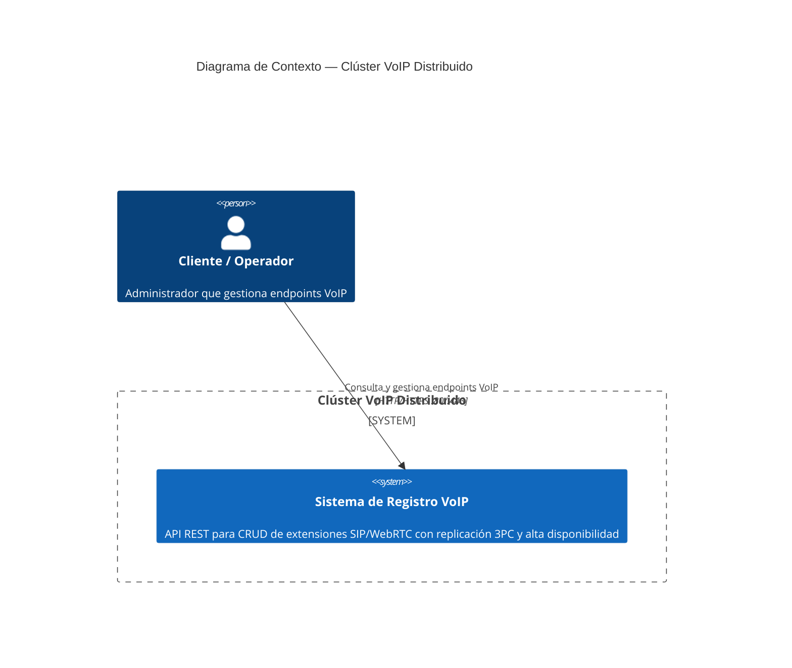
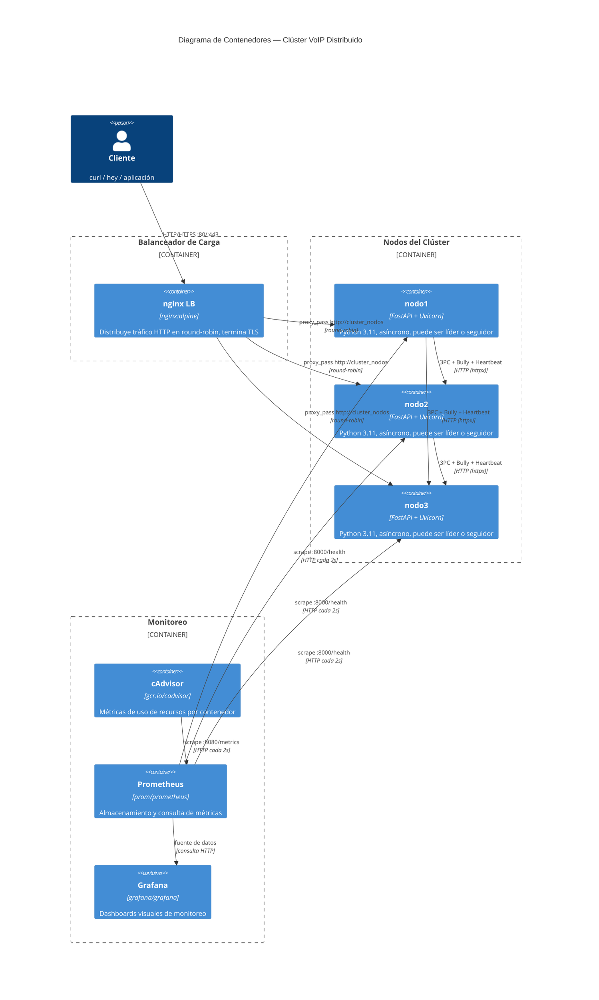
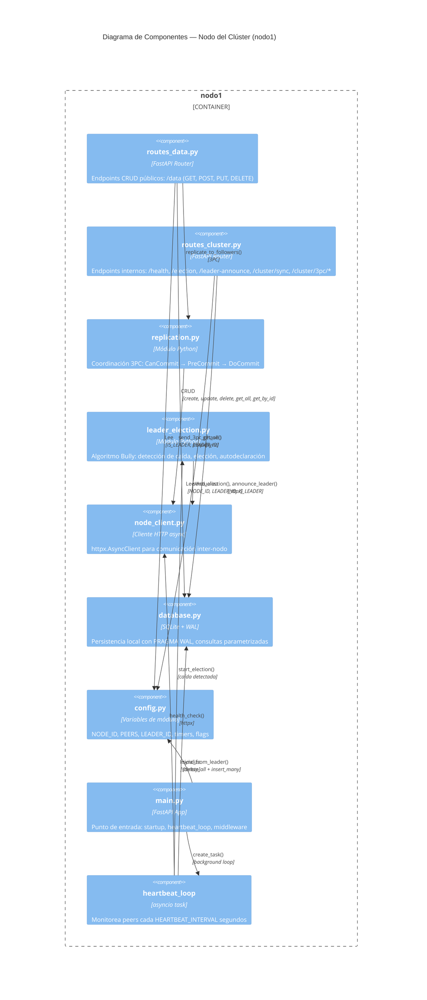
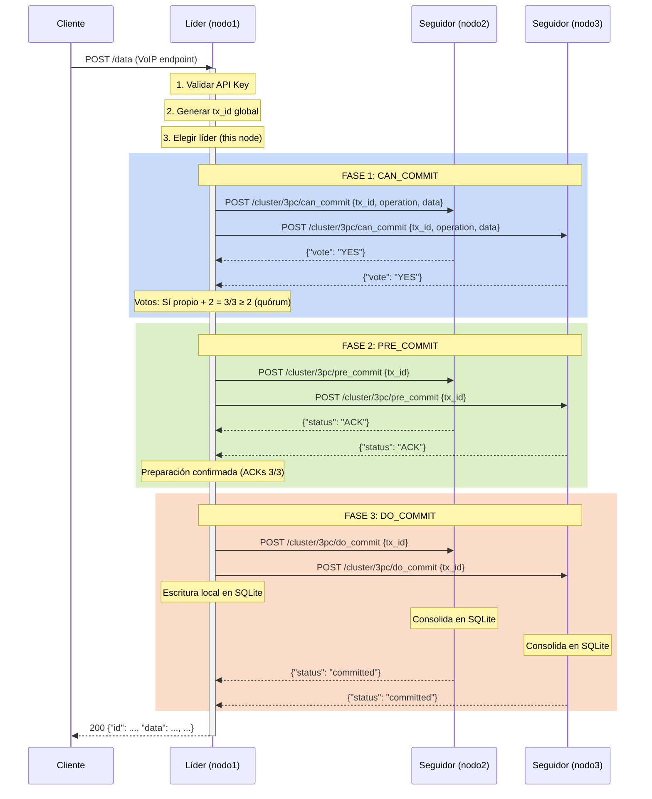

# Documento de Arquitectura — Clúster Distribuido de Servicios Web

> **Fase 1 — Planificación y Diseño Arquitectónico**
> Proyecto: Sistemas Distribuidos 2026

---

## 1. Justificación del Tipo de Clúster

Se elige un **clúster de servicios web** (no HPC ni Big Data) por las siguientes razones:

| Criterio | HPC | Big Data | Servicios Web (elegido) |
|---|---|---|---|
| **Carga de trabajo** | Cálculo intensivo (MPI, GPU) | Procesamiento batch (MapReduce) | **Operaciones CRUD + réplicas sincrónicas** |
| **Volumen de datos** | TB–PB por trabajo | TB–PB en reposo | **KB–MB por registro VoIP** |
| **Latencia requerida** | Horas–días | Minutos–horas | **< 100 ms por operación** |
| **Concurrencia** | Baja (jobs secuenciales) | Media (lotes) | **Alta (múltiples clientes simultáneos)** |
| **Middleware típico** | Slurm, OpenMPI | Hadoop, Spark | **FastAPI, Nginx, SQLite WAL** |
| **Protocolo de consenso** | No aplica | No aplica | **3PC (Three-Phase Commit)** |
| **Algoritmo de elección** | No aplica | No aplica | **Bully Algorithm** |

**Conclusión:** El clúster sirve peticiones REST concurrentes (alta disponibilidad, baja latencia, consistencia de datos), lo que lo alinea con la categoría de servicios web. El dominio concreto es el **Registro Distribuido de Endpoints VoIP (SIP, WebRTC)**, donde cada nodo mantiene una copia actualizada del inventario de extensiones activas.

---

## 2. Topología de Red

```
                             ┌──────────────┐
                             │   Cliente    │
                             │  (curl/hey)  │
                             └──────┬───────┘
                                    │ HTTP :80
                                    ▼
                     ┌──────────────────────────┐
                     │    nginx Load Balancer   │
                     │   (balanceo round-robin) │
                     │   Puerto 80 → 443 (TLS)  │
                     └──────┬──────────┬────────┘
                            │          │
              ┌─────────────┼──────────┼─────────────┐
              │             │          │             │
              ▼             ▼          ▼             │
      ┌──────────┐  ┌──────────┐  ┌──────────┐       │
      │  nodo1   │  │  nodo2   │  │  nodo3   │       │
      │ :8000    │  │ :8000    │  │ :8000    │       │
      │ LÍDER    │  │ SEGUIDOR │  │ SEGUIDOR │       │
      │ FastAPI  │  │ FastAPI  │  │ FastAPI  │       │
      │ SQLite   │  │ SQLite   │  │ SQLite   │       │
      └────┬─────┘  └────┬─────┘  └────┬─────┘       │
           │             │             │             │
           └─────────────┼─────────────┘             │
                         │ HTTP (httpx)              │
                         │ 3PC + Bully + Heartbeat   │
                         │                           │
              ┌──────────┴──────────┐                │
              │   cluster-net       │                │
              │  (Docker bridge)    │                │
              └─────────────────────┘                │
                                                     │
              ┌──────────┐  ┌──────────┐  ┌────────┐ │
              │ cAdvisor │  │Prometheus│  │ Grafana│ │
              │ :8080    │  │ :9090    │  │ :3000  │ │
              └──────────┘  └──────────┘  └────────┘ │
                                                     │
              ┌──────────────────────────────────────┘
              │
              ▼
      ┌──────────────────┐
      │   Internet / VM  │
      │  (puertos 80/443)│
      └──────────────────┘
```

### 2.1 Justificación de la topología

- **Un solo punto de entrada (nginx LB)**: simplifica el acceso del cliente, oculta la complejidad interna del clúster y distribuye la carga.
- **Red Docker bridge interna (`cluster-net`)**: los nodos se comunican por hostname Docker (resolución DNS interna), sin exponer tráfico de replicación/elección al exterior.
- **Sin puertos individuales en nodos**: solo el LB expone puertos al host, siguiendo el principio de mínimo privilegio.
- **Monitoreo en red interna**: cAdvisor, Prometheus y Grafana también en `cluster-net`; Grafana expone :3000 para acceso del administrador.

---

## 3. Dimensionamiento

### 3.1 Recursos por nodo

| Recurso | Valor | Justificación |
|---|---|---|
| **CPU** | 0.5 cores (límite Docker) | FastAPI es asíncrono; un core basta para ~500 req/s. SQLite WAL usa poco CPU en escrituras secuenciales. |
| **RAM** | 512 MB (límite Docker) | Python + FastAPI + Uvicorn ~80 MB; SQLite en memoria ~50 MB; buffer 3PC ~50 MB; resto para HTTP client y sistema (~300 MB de margen). |
| **Almacenamiento** | ~100 MB | SQLite con ~10,000 registros VoIP (~10 KB c/u) ocupa ~100 MB. Modo WAL agrega ~4 MB de archivo WAL. Volumen Docker persistente. |
| **Red** | 10 Mbps (mínimo) | Tráfico interno: heartbeats (~1 KB/3s), replicación 3PC (~5 KB por escritura), sincronización total (~10 MB ocasional). Carga insignificante. |

### 3.2 Throughput esperado

| Operación | Throughput estimado (1 nodo) | Throughput estimado (3 nodos + LB) | Cuello de botella |
|---|---|---|---|
| **GET /data** (lectura) | ~2000 req/s | ~6000 req/s | Lectura concurrente SQLite WAL (OK) |
| **POST /data** (escritura) | ~150 req/s | ~150 req/s (solo líder) | 3PC: 3 rondas HTTP + SQLite write (lider) |
| **PUT /data/{id}** | ~150 req/s | ~150 req/s (solo líder) | 3PC: 3 rondas HTTP + SQLite write |
| **DELETE /data/{id}** | ~150 req/s | ~150 req/s (solo líder) | 3PC: 3 rondas HTTP + SQLite write |

> **Nota:** Las escrituras están limitadas por el líder (único que escribe). El LB no acelera escrituras pero distribuye lecturas. Para mejorar throughput de escritura, haría falta particionar los datos (sharding por extensión).

### 3.3 Dimensionamiento de red

| Componente | Ancho de banda requerido | Latencia esperada |
|---|---|---|
| Cliente → LB | 1 Mbps (suficiente para ~6000 req/s con payloads < 1 KB) | < 5 ms (local) / < 50 ms (remoto) |
| LB → Nodo | 1 Mbps (distribuido) | < 1 ms (Docker bridge) |
| Nodo ↔ Nodo (3PC) | < 0.5 Mbps | < 2 ms (Docker bridge) |
| Nodo → Prometheus | < 0.1 Mbps (métricas cada 2s) | < 1 ms |

---

## 4. Diagramas C4

### 4.1 C1 — Diagrama de Contexto



### 4.2 C2 — Diagrama de Contenedores



### 4.3 C3 — Diagrama de Componentes (dentro de un nodo)



### 4.4 C4 — Diagrama de Código (Flujo 3PC)



---

## 5. Justificación Tecnológica

| Componente | Tecnología elegida | Alternativas | Por qué esta |
|---|---|---|---|
| **Lenguaje** | Python 3.11 | Node.js, Go, Java | Curva baja, bibliotecas maduras (FastAPI, httpx, Pydantic), prototipado rápido |
| **Framework API** | FastAPI + Uvicorn | Flask, Django REST, Express | Asíncrono nativo, rendimiento alto (~10K req/s), OpenAPI automático, validación Pydantic |
| **Base de datos** | SQLite con WAL | PostgreSQL, MySQL, Redis | Sin servidor externo, cada nodo tiene su `.db` independiente, WAL permite lecturas concurrentes. Volumen de datos bajo (~10K registros) |
| **Comunicación inter-nodo** | httpx (AsyncClient) | aiohttp, requests | API asíncrona, timeout configurable, manejo de excepciones robusto |
| **Contenedores** | Docker + Docker Compose | Kubernetes, Podman, Vagrant | Simplicidad: 3 nodos + LB en un solo `docker-compose up`. Suficiente para el alcance académico |
| **Balanceador** | nginx:alpine | HAProxy, Traefik, Caddy | Ligero (~5 MB), round-robin nativo, fácil configuración SSL, ampliamente documentado |
| **Protocolo de consenso** | 3PC (Three-Phase Commit) | 2PC, Paxos, Raft | No bloqueante (a diferencia de 2PC), más simple que Paxos/Raft, adecuado para 3 nodos conocidos |
| **Elección de líder** | Bully Algorithm | Ring Algorithm, Raft Leader Election | Simple: el nodo con mayor ID gana. 3 nodos → a lo sumo 1 round de mensajes. Sin log complexity |
| **Monitoreo** | Prometheus + cAdvisor + Grafana | ELK Stack, Datadog, Nagios | Stack open source estándar, cAdvisor expone métricas Docker, Prometheus scrapea, Grafana visualiza |
| **Orquestación** | Ansible | Terraform, Puppet, Chef | Sin agente (SSH), YAML declarativo, ideal para aprovisionar VMs y desplegar Docker Compose |

---

## 6. Protocolo 3PC — Detalle de Implementación

### 6.1 Fases

| Fase | Endpoint | Acción del coordinador (líder) | Acción del participante (seguidor) |
|---|---|---|---|
| **CanCommit** | `POST /cluster/3pc/can_commit` | Genera `tx_id`, pregunta a seguidores si pueden procesar la operación | Valida payload, guarda en `tx_buffer`, responde `{"vote": "YES"}` o HTTP 400 |
| **PreCommit** | `POST /cluster/3pc/pre_commit` | Recibe votos; si quórum ≥ 2, envía orden de preparación | Marca la transacción como preparada en buffer, responde `{"status": "ACK"}` |
| **DoCommit** | `POST /cluster/3pc/do_commit` | Consolida localmente y ordena a seguidores consolidar | Saca de buffer y escribe en SQLite, responde `{"status": "committed"}` |
| **Abort** | `POST /cluster/3pc/abort` | Notifica aborto si quórum insuficiente | Elimina entrada de `tx_buffer`, responde `{"status": "aborted"}` |

### 6.2 Quórum

- Voto líder = 1 (implícito Sí)
- Total participantes = 2 (seguidores)
- **Quórum mínimo = 2** (N/2 + 1 para 3 nodos)
- Si `votes_yes < 2` → se aborta la transacción

### 6.3 Manejo de fallos

| Escenario | Comportamiento |
|---|---|
| **Seguidor no responde CanCommit** | Voto contado como No. Si quórum < 2, aborto. |
| **Seguidor falla en PreCommit** | Aborto y limpieza de buffer. Líder se auto-degrada. |
| **Seguidor falla en DoCommit** | La transacción ya está comprometida. El seguidor se sincronizará vía sync total al recuperarse. |
| **Líder falla durante 3PC** | Los seguidores detectan por heartbeat, inician elección Bully. La tx queda abortada en los seguidores por timeout de buffer. |

---

## 7. Algoritmo Bully — Detalle de Implementación

### 7.1 Flujo

```
                    ┌──────────────┐
                    │ Líder muere  │
                    └──────┬───────┘
                           ▼
               ┌───────────────────────┐
               │ Nodo i detecta caída  │
               │ (MAX_FAILED_ATTEMPTS) │
               └──────────┬────────────┘
                          ▼
               ┌───────────────────────┐
               │ start_election()      │
               │ Envía ELECTION a      │
               │ nodos con ID > i      │
               └──────────┬────────────┘
                          ▼
              ┌───────────────────────┐
              │ ¿Algún nodo mayor     │
              │ respondió OK?         │
              └──────┬────────┬───────┘
                     │ NO     │ SÍ
                     ▼        ▼
              ┌──────────┐  ┌──────────────────┐
              │ Soy líder│  │ Otro toma control│
              │ become_leader() │ (esperar anuncio)│
              │ announce │  └──────────────────┘
              └──────────┘
```

### 7.2 Reglas

- **ID mayor gana**: comparación lexicográfica (`"nodo3" > "nodo2" > "nodo1"`)
- **Detección**: `HEARTBEAT_INTERVAL = 3s`, `MAX_FAILED_ATTEMPTS = 3` → ~9s para declarar líder muerto
- **Auto-degradación**: si el líder no logra quórum de replicación, se degrada a seguidor y libera su rol
- **Split-brain**: si dos nodos se creen líderes, el de mayor ID prevalece (el otro recibe `leader-announce` y se rinde)

---

## 8. Seguridad (Vista General)

*(Detalle completo en Fase 3)*

| Medida | Estado actual | Implementación prevista |
|---|---|---|
| Autenticación API | ❌ No implementada | Middleware `X-API-Key` en `/data` |
| Cifrado TLS | ❌ HTTP plano | Certificado self-signed en nginx :443 |
| Firewall | ❌ No configurado | UFW: solo 80, 443, 22 |
| Segregación de redes | ✅ Red Docker interna | Tráfico inter-nodo en `cluster-net` |
| Contenedor no-root | ✅ `USER appuser` en Dockerfile | Ya implementado |

---

*Documento generado en Fase 1 del plan de proyecto. Actualizar según evolución del diseño.*
